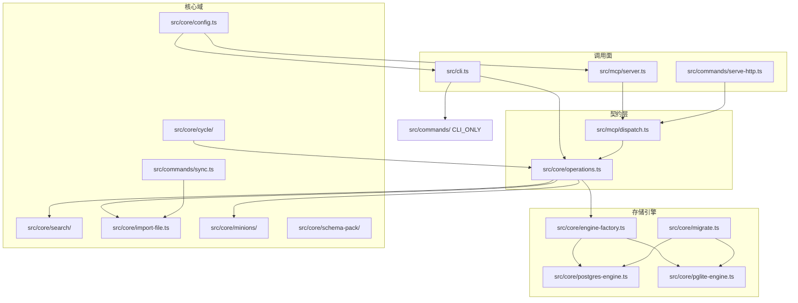

# gbrain 代码地图

> **文档类型**：项目总纲 / 代码地图（模板场景一）  
> **版本快照**：0.42.56.0  
> **用途**：导航 gbrain 仓库，供后续模块深读、流程深读、经验提炼使用。本文档可含 gbrain 专有名词；与 ADR/方案卡「脱离原项目」要求不同。

---

## 1. 项目背景

### 解决什么问题

GBrain 是个人/团队**知识大脑**层：在 Postgres/pgvector 上提供混合检索、知识图谱、合成问答、内容 enrichment 与 24/7 自治运转能力。README 的定位是「Search gives you raw pages. GBrain gives you the answer」——返回带引用的合成答案，并显式标注 brain 不知道什么（gap analysis）。

### 面向用户

- **Agent 平台**：OpenClaw、Hermes 等，通过 MCP 或 HTTP 接入
- **编码 Agent**：Claude Code、Codex、Cursor，通过 `gbrain serve` + MCP 获得 supercharged retrieval
- **CLI 独立用户**：直接运行 `gbrain` 命令管理 brain
- **公司 brain**：多租户 OAuth + source 隔离（`docs/tutorials/company-brain.md`）

### 典型使用场景

```
gbrain init          → 建脑（默认 PGLite，零配置）
gbrain sources add   → 注册内容 repo（source 轴）
gbrain sync          → 导入 markdown → page → chunk
gbrain embed --stale → 向量化 stale chunks
gbrain query / think → 检索 + 合成
gbrain dream         → 夜间 enrichment / extract / consolidate
gbrain serve         → MCP stdio/HTTP，供 agent 调用
```

---

## 2. 技术栈

| 类别 | 选型 | 证据 |
|------|------|------|
| 语言 | TypeScript | `package.json` `"type": "module"` |
| 运行时 | Bun | `package.json` scripts、`bin.gbrain` → `src/cli.ts` |
| 默认 DB | PGLite（WASM 嵌入式 Postgres） | `engine-factory.ts` case `'pglite'` |
| 生产 DB | Postgres + pgvector | `postgres-engine.ts`、`docs/ENGINES.md` |
| Agent 协议 | MCP（stdio + HTTP） | `src/mcp/server.ts`、`src/commands/serve.ts` |
| 构建 | `bun build --compile` → 独立二进制 | `package.json` `"build"` |
| Admin UI | Vite 前端嵌入 | `admin/`、`build:admin` script |
| 测试 | 多 shard 单元 + E2E 双引擎 parity | `test/`、`test/e2e/`、`bun run ci:local` |
| 版本 | 0.42.56.0 | `VERSION` + `package.json`（需一致） |

**精确规模（本次统计）**

| 指标 | 数量 | 统计方式 |
|------|------|----------|
| Operation 契约 | **100** | `src/core/operations.ts` 中 `name: '` 出现次数 |
| CLI_ONLY 命令 | **84** | `src/cli.ts:47` `CLI_ONLY` Set 元素数 |
| commands 源文件 | **125** | `src/commands/*.ts` 文件数 |
| skills 目录 SKILL.md | **53** | `skills/**/SKILL.md` |
| core 子模块目录 | **41** | `src/core/` 一级子目录 |

---

## 3. 核心模块地图

### 架构关系图



### 十大核心模块

| # | 模块 | 关键路径 | 职责 | 与其他模块关系 | 深读 |
|---|------|----------|------|----------------|------|
| 1 | **契约层 Operations** | `src/core/operations.ts` | 100 个 read/write/admin Operation；CLI 与 MCP 唯一契约来源；`OperationContext.remote` 区分 trusted local vs untrusted remote | 所有读写经 `sourceScopeOpts(ctx)` 过滤 source；handler 调用 engine + core 域逻辑 | **P0** |
| 2 | **双引擎 + 迁移** | `engine-factory.ts`、`engine.ts`、`postgres-engine.ts`、`pglite-engine.ts`、`migrate.ts` | 动态 import 避免 PGLite WASM 污染 Postgres 用户；schema 版本迁移；两引擎 lockstep parity | Operations handler 只依赖 `BrainEngine` 接口；E2E parity 测试约束 | **P0** |
| 3 | **混合检索** | `src/core/search/`（`hybrid.ts`、`mode.ts`、`query-cache.ts`、`relational-recall.ts`、`autocut.ts`） | 向量 + BM25 + RRF + 图谱遍历 + 关系召回；search mode bundles（conservative/balanced/tokenmax）；query 缓存 knobs_hash 防污染 | `query`/`search` op 入口；`docs/architecture/RETRIEVAL.md` 四策略说明 | **P0** |
| 4 | **导入 / Sync** | `src/commands/sync.ts`、`src/core/import-file.ts`、`src/core/ingestion/` | 文件系统 → page upsert → link extract → chunk；per-source lock + checkpoint 可恢复；pace mode 控 DB 争用 | 调用 engine 写入；可选 auto-embed；与 `embed-backfill-lock.ts` 单飞 | **P0** |
| 5 | **CLI 命令层** | `src/commands/`（125 文件） | 复杂 bulk 命令编排（doctor、embed、eval、extract…）；84 个 `CLI_ONLY` 绕过或包装 operations | `src/cli.ts` 分发；部分命令（如 `sync`、`doctor`）自有 progress 报告 | **P1** |
| 6 | **MCP 传输** | `src/mcp/`、`src/commands/serve.ts`、`serve-http.ts` | `buildToolDefs(operations)` 生成 tool 列表；`dispatch.ts` 统一 scope/localOnly 校验；stdio 默认 `remote: true` | 与 CLI `gbrain call`（`remote=false`）行为差异；HTTP OAuth 多租户 | **P1** |
| 7 | **Minions 作业** | `src/core/minions/`、`src/commands/jobs.ts` | 后台 shell job + LLM agent job；DB 锁续期、进度、预算计量 | `submit_job`/`submit_agent` operations；supervisor 与 pool 争用（pace mode 缓解） | **P1** |
| 8 | **Dream Cycle** | `src/core/cycle/`、`src/commands/dream.ts` | 夜间多阶段 enrichment（extract、takes、consolidate…）；protected phase handlers 仅 local trusted | cron/minion 触发；依赖 operations 写路径 | **P1** |
| 9 | **Schema Packs** | `src/core/schema-pack/` | 页面类型 taxonomy、提取规则、pack 升级；9 个 schema_* operations 暴露 MCP | 与 `extract`、`schema` CLI 命令联动 | **P1** |
| 10 | **Skills 生态** | `skills/`（53 SKILL.md）、`src/core/skillpack/` | Fat markdown skills 教 agent 如何操作 brain；`RESOLVER.md` 路由；brain-resident skillpack | 非运行时核心，但定义 agent 操作协议 | **P2** |

### src/core/ 一级子目录（41 个）

`advisor`、`ai`、`artifact`、`audit`、`bench`、`brainstorm`、`budget`、`calibration`、`chronicle`、`chunkers`、`claw-test`、`code-intel`、`context`、`conversation-parser`、`cross-modal-eval`、`cycle`、`diarize`、`distribution`、`enrich`、`enrichment`、`entities`、`eval`、`eval-contradictions`、`eval-shared`、`extract`、`facts`、`ingestion`、`minions`、`onboard`、`output`、`progressive-batch`、`remediation`、`resolvers`、`schema-pack`、`search`、`skillify`、`skillopt`、`skillpack`、`storage`、`takes-quality-eval`、`think`

### src/ 顶层结构

| 目录 | 职责 |
|------|------|
| `src/cli.ts` | CLI 入口、命令分发、operation 查找 |
| `src/commands/` | CLI_ONLY 与 bulk 命令实现 |
| `src/core/` | 域逻辑、engine、operations 契约 |
| `src/mcp/` | MCP server、dispatch、tool-defs |
| `src/eval/` | LongMemEval 等 eval harness |
| `src/types/` | 共享类型 |
| `src/assets/` | 静态资源 |

---

## 4. 整体架构判断（待深读，暂不下定论）

### 最核心的抽象

1. **Contract-first Operation**：`operations.ts` 定义 name、scope（read/write/admin）、handler、cliHints；CLI 与 MCP 从同一数组生成，避免接口漂移。
2. **BrainEngine 接口**：postgres-engine 与 pglite-engine 实现同一 SQL 形状，迁移在 `migrate.ts` 的 `MIGRATIONS` 数组。
3. **双轴路由**：Brain（哪个 DB）× Source（DB 内哪个 repo），六层 precedence 解析（`--brain`/`--source`、env、dotfile）。见 `docs/architecture/brains-and-sources.md`。

### 分层边界

```
src/commands/     CLI 编排、progress、人类交互
       ↓
src/core/operations.ts   契约 + 信任边界 + source 隔离
       ↓
src/core/*        域逻辑（search、cycle、minions…）
       ↓
BrainEngine       SQL / pgvector / 事务
```

### 一眼可见的重大设计取舍（待深读验证）

| 取舍 | 表现 | 待深读问题 |
|------|------|------------|
| 契约优先 vs 命令膨胀 | 100 ops + 84 CLI_ONLY 并存 | 哪些命令必须 bypass op？迁移路径？ |
| 双引擎 parity | PGLite 默认零配置；Postgres 生产 | JSONB 绑定、CONCURRENTLY 索引差异如何 guard？ |
| Trust fail-closed | MCP `remote=true`；CLI `remote=false` | 各 op 的 strip/guard 完整清单？ |
| Fat skills + thin harness | 53 个 SKILL.md，逻辑在 markdown | skill 与 op 的映射关系？ |
| Search mode bundles | conservative/balanced/tokenmax 成本差 25x | mode 解析链路与 cache key 版本 |
| Pace mode | embed/sync 可选 DB pacing | 与 minion lock renewal 的交互 |

---

## 5. 主流程识别

以下 5 条流程最值得场景三「流程深读」：

### 5.1 Query 检索链路

```
用户/agent → query op (operations.ts)
  → resolveSearchMode / knobs (search/mode.ts)
  → hybridSearch (search/hybrid.ts)
      → 向量召回 + BM25 + RRF
      → 可选 relational recall (relational-recall.ts)
      → 可选 graph traverse
      → reranker (ZeroEntropy 等)
  → token budget 截断
  → query_cache 读写 (query-cache.ts, knobs_hash 防污染)
  → 返回 results + meta + gap hints
```

**入口证据**：`operations.ts` 中 `query` op；`docs/architecture/RETRIEVAL.md` 四策略。

### 5.2 Sync 导入链路

```
gbrain sync (commands/sync.ts, CLI_ONLY)
  → per-source lock + heartbeat
  → checkpoint (op_checkpoint_paths)
  → 遍历 source local_path
  → import-file.ts → page upsert
  → link extraction (零 LLM)
  → chunk
  → 可选 auto-embed
  → pace mode 可选 (db-pacer.ts)
```

**入口证据**：`src/cli.ts:47` 含 `'sync'`；CLAUDE.md sync resumability 表。

### 5.3 Put page 写链路

```
put_page op
  → markdown 解析 / frontmatter
  → validate slug (source_id, slug) 复合唯一
  → entity ref 提取 → typed edges (attended, works_at…)
  → version 写入
  → query_cache / schema 缓存失效
  → remote=true 时 provenance 字段 server _stamp
```

**入口证据**：`operations.ts` `put_page`；`docs/architecture/RETRIEVAL.md` Auto-link 节。

### 5.4 MCP 工具调用链路

```
Agent → ListTools → buildToolDefs(operations)
     → CallTool → dispatch.ts
         → validateParams
         → scope / localOnly 检查
         → buildOperationContext (remote=true, sourceId, auth)
         → op.handler
         → metaHook (brain hot memory 注入)
```

**入口证据**：`src/mcp/server.ts:27-55`；`src/mcp/dispatch.ts`（待深读）。

### 5.5 Dream cycle 自治链路

```
cron / minion → gbrain dream (CLI_ONLY)
  → cycle phases (src/core/cycle/)
  → extract / enrich / consolidate / takes…
  → protected handlers: ctx.remote === false only
  → spend gate / budget cap
```

**入口证据**：`src/cli.ts:47` 含 `'dream'`；CLAUDE.md protected phase handlers 说明。

---

## 6. 阅读优先级

### P0 必须读

| 文件/目录 | 原因 |
|-----------|------|
| `src/core/operations.ts` | 100 个 op 契约、trust boundary、sourceScopeOpts |
| `src/core/engine.ts` + 双 engine 实现 | 所有 SQL 形状 |
| `src/core/migrate.ts` | Schema 演进 |
| `src/core/search/hybrid.ts` + `mode.ts` | 检索核心 |
| `src/core/import-file.ts` | 写入路径 |
| `docs/architecture/KEY_FILES.md` | 按文件索引 invariants（按需条目） |
| `docs/architecture/brains-and-sources.md` | 双轴路由 |

### P1 建议读

| 文件/目录 | 原因 |
|-----------|------|
| `src/mcp/dispatch.ts` | MCP 与 CLI 行为 parity |
| `src/core/minions/` | 后台作业 |
| `src/core/cycle/` | Dream cycle |
| `src/core/config.ts` | brain/source/engine 解析 |
| `docs/architecture/RETRIEVAL.md` | 检索设计 rationale |
| `docs/ENGINES.md` | 双引擎差异与 JSONB 规则 |

### P2 暂时可不读

| 文件/目录 | 原因 |
|-----------|------|
| `admin/` | 管理 UI |
| `evals/functional-area-resolver/` | 评估 harness，非运行时 |
| `recipes/` | 示例 recipe |
| `scripts/check-*.sh` | CI guard，按需 grep |
| `skills/migrations/` | 版本迁移说明文档 |
| `test/fixtures/` | 测试夹具 |

---

## 7. 暂不阅读范围

| 目录 | 不读原因 |
|------|----------|
| `admin/` | Vite 管理界面，与 brain 核心逻辑解耦 |
| `evals/` | 离线评估，不影响生产路径理解 |
| `test/fixtures/`、`test/helpers/` | 测试支撑 |
| `scripts/` 大量 check 脚本 | 变更时 CI 会指出；首读不必通读 |
| `.github/` | CI 配置 |
| `skills/migrations/` | 面向用户的升级说明，非机制代码 |

---

## 8. 已确认事实

| 事实 | 证据 |
|------|------|
| CLI 入口为 `src/cli.ts` | `package.json` `"bin": { "gbrain": "src/cli.ts" }` |
| 双引擎：pglite / postgres | `engine-factory.ts:11-19` switch |
| 100 个 Operation | `operations.ts` 中 `name: '` 计数 = 100 |
| 84 个 CLI_ONLY 命令 | `cli.ts:47` Set 元素计数 |
| MCP stdio 默认 remote=true | `mcp/server.ts:43-44` |
| Brain × Source 正交路由 | `docs/architecture/brains-and-sources.md` |
| 检索四策略：向量+BM25+RRF+图谱 | `docs/architecture/RETRIEVAL.md:5-10` |
| 版本 0.42.56.0 | `VERSION` 文件 |
| operations 数组导出位置 | `operations.ts:5316-5401` |
| 核心 library exports | `package.json` `"exports"` 字段（operations、engine、search/hybrid 等） |

---

## 9. 推测和未确认问题

| 项 | 状态 |
|----|------|
| HTTP MCP OAuth token → source 授权映射细节 | **未读** `serve-http.ts`、`src/commands/auth.ts` |
| Minions supervisor 主循环与 lock renewal 时序 | **未读** minions worker 入口；CLAUDE.md 仅有 pacing 概述 |
| Code Cathedral（code-intel）与 query 的集成深度 | **未追** `code_blast`/`code_flow` op 调用链 |
| 100 ops 中 read/write/admin 各多少 | **未统计** scope 字段分布 |
| RLS 多租户具体表策略 | **未读** `docs/guides/rls-and-you.md` 与 schema |
| `think` op 与 trajectory/facts 的自动联动 | README/CLAUDE 提及 v0.40.2.0；**未读** `src/core/think/` |
| Admin embedded 与 serve 的路由关系 | **未读** admin 构建链 |

---

## 10. 下一步任务建议

拆成 6 个子任务，每个只聚焦一个模块或一条流程：

1. **深读 operations + dispatch** — 信任边界、`sourceScopeOpts`、scope enforcement、remote strip 清单  
2. **深读 hybrid search 全链路** — knobs_hash 版本、relational recall、autocut、reranker 开关  
3. **深读 sync + import-file + embed-backfill** — lock key、checkpoint 表、pace mode、stall watchdog  
4. **深读 cycle/dream** — phase 顺序、protected ops、spend gate  
5. **深读 minions/jobs** — submit → work → progress → lock renewal → PgBouncer 争用  
6. **深读 schema-pack + extract** — page types、facts/takes 提取、pack lock  

---

## 附录 A：已阅读文件列表

| 文件 | 阅读方式 |
|------|----------|
| `README.md` | 前 120 行 |
| `package.json` | 前 80 行 + version |
| `VERSION` | 全文 |
| `AGENTS.md` / `CLAUDE.md` | workspace rules 加载 |
| `src/cli.ts` | 前 100 行（CLI_ONLY、入口） |
| `src/core/operations.ts` | 5316-5405 行（operations 数组） |
| `src/core/engine-factory.ts` | 全文 |
| `src/mcp/server.ts` | 前 80 行 |
| `docs/architecture/brains-and-sources.md` | 前 120 行 |
| `docs/architecture/RETRIEVAL.md` | 前 60 行 |
| `src/commands/` | 目录枚举（125 文件） |
| `src/core/` | 目录枚举（41 子目录） |
| `skills/` | SKILL.md 计数（53） |

## 附录 B：未阅读但可能重要的文件

| 文件 | 重要性 |
|------|--------|
| `src/mcp/dispatch.ts` | MCP 调度核心 |
| `src/core/search/hybrid.ts` | 检索实现 |
| `src/core/import-file.ts` | 导入核心 |
| `src/core/migrate.ts` | Schema 全貌 |
| `src/core/config.ts` | 配置解析链 |
| `src/commands/sync.ts` | Sync 编排 |
| `src/commands/serve-http.ts` | HTTP MCP + OAuth |
| `src/core/minions/supervisor.ts`（路径待核实） | 作业调度 |
| `src/core/cycle/base-phase.ts` | Cycle 阶段基类 |
| `docs/architecture/KEY_FILES.md` | 全文件索引（447KB，按需条目读） |

## 附录 C：统计命令留痕

```powershell
# CLI_ONLY 计数
node -e "const fs=require('fs'); const s=fs.readFileSync('src/cli.ts','utf8'); const m=s.match(/const CLI_ONLY = new Set\(\[([^\]]+)\]/); console.log(m[1].match(/'[^']+'/g).length);"
# 输出: 84

# Operation name 计数
rg "^\s+name: '" src/core/operations.ts --count
# 输出: 100
```

---

*生成依据：《开源项目工程经验提炼提示词模板》场景一。未经场景五审查，不作为经验库条目入库。*
