# gbrain dream cycle 阶段机模块深读笔记（模板场景二）

> 模块：src/core/cycle.ts + src/core/cycle/ 目录，聚焦 phase 顺序 / protected phase handlers / spend gate 三机制
> 仓库：gbrain v0.42.56.0
> 性质：中间产物，不入 `知识库/经验/`，与 `gbrain-代码地图.md` 同级

---

## 1. 模块背景

gbrain 在夜间或 cron 触发时跑一个 dream cycle，依次执行十几个 phase：lint、backlinks、sync、synthesize、extract_facts、extract_atoms、patterns、consolidate、calibration 三联（propose_takes / grade_takes / calibration_profile）、embed、orphans、purge 等。每个 phase 是一个独立的 LLM 调用 + DB 写入单元，有的 per-source，有的 global，有的需要 trusted ctx。

本模块的核心问题不是"单个 phase 怎么做"，而是"十几个 phase 怎么编排、哪些必须 trusted、怎么不让 LLM 花爆预算"。本次深读聚焦三个机制：phase 顺序（阶段编排）、protected phase handlers（受保护阶段处理器）、spend gate（预算闸门）。

## 2. 核心职责

负责：

- 按拓扑序执行十几个 phase，每个 phase 独立 try/catch
- per-source lock 与 global phase 的矛盾处理（global phase 拆到独立 job）
- 受保护 phase（synthesize / patterns / consolidate / calibration 三联等）的 trust 边界 enforcement
- per-phase 预算闸门，超支 clean abort 不回滚
- cycle lock TTL 与 maybeYield 节流的配合

不负责：

- 单个 phase 的 LLM 调用细节（每个 phase 有自己的实现文件）
- minion queue 的调度（cycle 内 calibration 三联不经 queue，直接构造 ctx）
- embed 向量化（embed phase 调 engine.embed，本深读不追）
- budget 审计账本的轮转（budget-meter.ts 写文件，cycle 不参与轮转逻辑）

## 3. 核心对象

### 入口与编排

| 对象 | 文件:行号 | 作用 |
|---|---|---|
| `runDream` | `src/commands/dream.ts:508` | CLI `gbrain dream` 入口 |
| `runCycle` | `src/core/cycle.ts:1406` | 唯一编排器，签名 `(engine, opts: CycleOpts): Promise<CycleReport>` |
| `ALL_PHASES` | `src/core/cycle.ts:101-186` | phase 顺序数组（拓扑序） |
| `CyclePhase` | `src/core/cycle.ts:57-99` | phase 名联合类型 |
| `PHASE_SCOPE` | `src/core/cycle.ts:210-243` | source/global/mixed 分类 |
| `GLOBAL_PHASES` / `NON_GLOBAL_PHASES` | `src/core/cycle.ts:258-259` | global phase 集合 |
| `NEEDS_LOCK_PHASES` | `src/core/cycle.ts:272-308` | 需要持锁的 phase 集合 |
| `deriveStatus` | `src/core/cycle.ts:2431-2452` | 汇总 phase results 成 ok/clean/partial/failed |
| `extractTotals` | `src/core/cycle.ts:2384` | 汇总计数 |

### A. phase 顺序

| 对象 | 文件:行号 | 作用 |
|---|---|---|
| `ALL_PHASES` 数组顺序 | `src/core/cycle.ts:101-186` | 即拓扑序：lint → backlinks → sync → synthesize → extract → extract_facts → extract_atoms → resolve_symbol_edges → patterns → synthesize_concepts → recompute_emotional_weight → consolidate → calibration 三联 → conversation_facts_backfill → enrich_thin → skillopt → embed → orphans → schema-suggest → purge |
| `runPhaseXxx` 系列 | `src/core/cycle.ts:741+` | 每个 phase 一个 runner，try/catch 返回 PhaseResult |
| `timePhase` | `src/core/cycle.ts` | 计时包装 |
| `safeYield` | `src/core/cycle.ts` | phase 之间的 `yieldBetweenPhases` 让出事件循环 |
| `checkAborted` | `src/core/cycle.ts:723-730` | phase 之间检查 abort signal |

### B. protected phase handlers

| 对象 | 文件:行号 | 签名/作用 |
|---|---|---|
| `PROTECTED_JOB_NAMES` | `src/core/minions/protected-names.ts:15-66` | `ReadonlySet<string>`，含 `'synthesize'`、`'patterns'`、`'consolidate'`、`'skillopt'`、`'extract-atoms-drain'` 等 |
| `isProtectedJobName` | `src/core/minions/protected-names.ts:69-71` | `(name): boolean` |
| `calibrationCtx` 构造 | `src/core/cycle.ts:2019-2026` | cycle 内构造 `{ ..., remote: false as const }` 给 calibration 三联用 |
| `submit_job` op 的 trust 校验 | `src/core/operations.ts:2817-2825` | `ctx.remote !== false && isProtectedJobName(name)` → 抛错；`ctx.remote === false && isProtectedJobName(name)` → 设 `allowProtectedSubmit` |
| `queue.ts` 的二次校验 | `src/core/minions/queue.ts:90-92` | `isProtectedJobName && !trusted?.allowProtectedSubmit` → 抛错 |

### C. spend gate

| 对象 | 文件:行号 | 签名/作用 |
|---|---|---|
| `BudgetMeter` 类 | `src/core/cycle/budget-meter.ts:75-180` | 累计式 USD 预算计，`cumulativeUsd: number`（进程内，:76） |
| `BudgetMeterOpts` | `src/core/cycle/budget-meter.ts:28-35` | `{ budgetUsd, phase, auditPath? }` |
| `check` | `src/core/cycle/budget-meter.ts:89` | `(estimate: SubmitEstimate): BudgetCheckResult`，从不抛，只返回 `{ allowed, reason }` |
| `BaseCyclePhase` | `src/core/cycle/base-phase.ts` | v0.36.1.0 抽象基类，封装 source-scope 强制 + BudgetMeter + 错误捕获 + progress tick |
| `resolveBudgetUsd` | `src/core/cycle/base-phase.ts:142-170` | 子类声明预算 |
| `checkBudget` | `src/core/cycle/base-phase.ts:118-130` | protected 方法，子类调 |
| `BudgetTracker` | `src/core/budget/budget-tracker.ts`（未读） | 另一个预算类，conversation-facts-backfill / enrich-thin 用，AsyncLocalStorage 作用域 |

### cycle lock

| 对象 | 文件:行号 | 作用 |
|---|---|---|
| `LOCK_TTL_MS = 5 * 60 * 1000` | `src/core/cycle.ts:500` | cycle lock TTL，v0.41.19.0 从 30min 降到 5min |
| `LOCK_TTL_MINUTES = 5` | `src/core/cycle.ts:501` | 传给 `tryAcquireDbLock` |
| `acquireDbCycleLock` | `src/core/cycle.ts:558` | DB 锁获取（命名空间 `gbrain-cycle:`） |
| `acquireFileLock` | `src/core/cycle.ts:575` | 文件锁 fallback |
| `reapDeadHolderLocks` | `src/core/cycle.ts:1576` | 死 holder 清理 |
| `buildYieldDuringPhase` | `src/core/cycle.ts:661-683` | long phase 内部主动 `lock.refresh()` 的包装 |
| `maybeYield` 节流 | `extract-atoms.ts:459-472`、`synthesize-concepts.ts:162` | 30s 节流，匹配 lock TTL 刷新节奏 |

## 4. 内部流程

### cycle 主调用链

```mermaid
flowchart TB
  Dream[runDream dream.ts:508] --> Parse[parseArgs dream.ts:106]
  Parse --> Brain[resolveBrainDir dream.ts:253]
  Brain --> Cycle[runCycle cycle.ts:1406]
  Cycle --> Lock[acquireDbCycleLock / acquireFileLock cycle.ts:558/575]
  Lock --> Reap[reapDeadHolderLocks cycle.ts:1576]
  Reap --> Try[try 块]
  Try --> P1[Phase 1 lint cycle.ts:1589]
  P1 --> P2[Phase 2 backlinks :1604]
  P2 --> P3[Phase 3 sync :1629]
  P3 --> P4[Phase 4 synthesize :1655]
  P4 --> P5[Phase 5 extract :1692]
  P5 --> P5b[Phase 5b extract_facts :1724]
  P5b --> PA[extract_atoms :1778]
  PA --> PSym[resolve_symbol_edges :1838]
  PSym --> P6[Phase 6 patterns :1863]
  P6 --> PSC[synthesize_concepts :1893]
  PSC --> P7[Phase 7 recompute_emotional_weight :1937]
  P7 --> P8[Phase 8 consolidate :1977]
  P8 --> Cal[calibration 三联 cycle.ts:2012-2073]
  Cal --> CFB[conversation_facts_backfill :2082]
  CFB --> ET[enrich_thin :2110]
  ET --> SK[skillopt :2138]
  SK --> P8b[Phase 8 embed :2166]
  P8b --> P9[Phase 9 orphans :2187]
  P9 --> SS[schema-suggest :2213]
  SS --> P9b[Phase 9 purge :2257]
  P9b --> Fin[finally: lock.release cycle.ts:2276-2280]
  Fin --> Tot[extractTotals cycle.ts:2283]
  Tot --> Stat[deriveStatus cycle.ts:2284]
  Stat --> Upd[updateSourceConfig last_source_cycle_at cycle.ts:2325]
```



### phase 之间的衔接机制

每个 phase 用 `if (phases.includes('xxx'))` 包裹，phase 内部 `progress.start('cycle.xxx')` → `timePhase(() => runPhaseXxx(...))` → push `phaseResults` → `progress.finish()` → `await safeYield(opts.yieldBetweenPhases)`。

phase 之间**不显式传数据**，而是通过外层闭包变量在 phase 块之间传递：

- `syncPagesAffected`（cycle.ts:1622-1628）
- `synthesizeWrittenSlugs`（cycle.ts:1683-1685）
- `syncAttempted`（cycle.ts:1755-1756）
- `cycleSourceId`（cycle.ts:1808-1814、1953-1959）

每个 phase 之间还插 `checkAborted(opts.signal)`（cycle.ts:1590/1605/1630/1693 等），让 abort signal 在 phase 边界生效。

### calibration 三联的特殊处理

cycle.ts:2012-2073 不走 minion queue，直接构造：

```ts
const calibrationCtx = { ..., remote: false as const };  // cycle.ts:2024
await runPhaseProposeTakes(engine, calibrationCtx, ...);  // :2028
await runPhaseGradeTakes(engine, calibrationCtx, ...);    // :2039
await runPhaseCalibrationProfile(engine, calibrationCtx, ...);  // :2050
```

理由（cycle.ts:2009-2011）：cycle 是 operator CLI / autopilot daemon，OS 已是 trust 边界，不需要再经 minion queue 的 trust 校验。

## 5. 对外接口

### CLI

- `gbrain dream` → `runDream`（dream.ts:508）
- `gbrain dream --phases <list>` → 跑指定 phase 子集
- `gbrain dream --drain` → bounded drain 模式（dream.ts:82 `DEFAULT_DRAIN_WINDOW_SECONDS = 300`）
- `gbrain dream --dry-run` → 不写 DB

### 给 autopilot daemon 暴露

- `runCycle` 被 `src/commands/autopilot.ts:959-960` inline 调用
- `src/commands/jobs.ts:1718` 的 `autopilot-cycle` handler 读 `ALL_PHASES` 校验
- `src/commands/jobs.ts:1768` 的 global-maintenance handler
- `src/commands/jobs.ts:1915-1928` 的 `makePhaseHandler` 单 phase wrapper
- `src/commands/autopilot-fanout.ts:35` import `NON_GLOBAL_PHASES, GLOBAL_PHASES, LAST_GLOBAL_AT_KEY` 做 per-source fan-out

### 给 ops 层暴露

- `PROTECTED_JOB_NAMES` 被 `operations.ts:2812/2817/2825` 的 `submit_job` op 引用，拒绝远程 caller 提交 protected name
- `isProtectedJobName` 被 `queue.ts:90` 二次校验

### 不对外暴露

- `calibrationCtx` 是 cycle 内部构造的，外部不能复用
- `BudgetMeter` 是 export 的，但实际只被 cycle 子 phase 和 auto-think/drift 用

## 6. 扩展点

新增一个 phase 要改的地方：

1. `src/core/cycle.ts:57-99` 的 `CyclePhase` 联合类型加名字
2. `src/core/cycle.ts:101-186` 的 `ALL_PHASES` 数组按拓扑位置插入
3. `src/core/cycle.ts:210-243` 的 `PHASE_SCOPE` 标 source/global/mixed
4. `src/core/cycle.ts:272-308` 的 `NEEDS_LOCK_PHASES` 决定是否持锁
5. 在 `runCycle` 内（cycle.ts:1587-2275）加 `if (phases.includes('xxx'))` 块，调 `runPhaseXxx`
6. 写 `runPhaseXxx` 函数，try/catch 返回 PhaseResult
7. 如果是 protected phase，加进 `protected-names.ts:15-66` 的 `PROTECTED_JOB_NAMES`
8. 如果用 BudgetMeter，继承 `BaseCyclePhase` 或直接 `new BudgetMeter`

新增一个 protected phase 名要改的地方：

1. `src/core/minions/protected-names.ts:15-66` 的 `PROTECTED_JOB_NAMES` Set 加名字
2. 决定是 cycle 内直接调（构造 `remote: false as const` ctx）还是经 minion queue（trust 校验在 op 层）
3. 若 cycle 内直接调，在 cycle.ts:2012-2073 风格的块里加调用

新增一个预算源要改的地方：

1. 决定用 `BudgetMeter`（cycle 子 phase）还是 `BudgetTracker`（enrich 类）
2. `BudgetMeter` 子类在 `resolveBudgetUsd` 声明默认值 + config key
3. 在 `process()` 内每次 LLM submit 前调 `this.checkBudget(estimate)`
4. 超支时设 `budget_exhausted: true` + push warning + break/continue，不抛

调整 phase 顺序要改的地方：

1. `ALL_PHASES` 数组顺序就是拓扑序，直接调
2. 但要先确认依赖关系——`consolidate.ts:162-169` 注释说明 extract_facts 会 `deleteFactsForPage + insertFacts` 清空 `consolidated_at`，若 consolidate 先跑会产生重复 take
3. 同步更新 `PHASE_SCOPE` 和 `NEEDS_LOCK_PHASES` 如果作用域变了

## 7. 错误处理

### 关键阈值与魔法数字

#### 锁与 TTL

| 值 | 位置 | 上下文 |
|---|---|---|
| `LOCK_TTL_MS = 5 * 60 * 1000`（5min，was 30） | `cycle.ts:500` | cycle lock TTL，v0.41.19.0 从 30min 降到 5min |
| `LOCK_TTL_MINUTES = 5` | `cycle.ts:501` | 传给 `tryAcquireDbLock` |
| `30_000`（30s） | `cycle.ts:459-472`、`synthesize-concepts.ts:162` | `maybeYield` 节流间隔，匹配 lock TTL 刷新节奏 |
| `FORCE_EVICT_DEADLINE_MS = 30_000` | `cycle.ts:2303` | worker force-evict 30s 宽限 |
| `DEFAULT_DRAIN_WINDOW_SECONDS = 300` | `dream.ts:82` | `--drain` 默认 5 分钟窗口 |
| `EXIT_DRAIN_INCOMPLETE = 3` | `dream.ts:84` | backlog 未清空时退出码 |

#### consolidate 阈值

| 值 | 位置 | 上下文 |
|---|---|---|
| `threshold = 0.85` | `consolidate.ts:53` | cosine 聚类阈值 |
| `minPerBucket = 3` | `consolidate.ts:54` | 每个 (source, entity) bucket 至少 3 条 fact 才合并 |
| `minOldestAgeMs = 24h` | `consolidate.ts:55` | bucket 中最老 fact 至少 24h 才合并 |
| `limit: 100` | `consolidate.ts:104` | `listFactsByEntity` 单 bucket 上限 |
| cluster 长度 `< 2` 跳过 | `consolidate.ts:141` | 单元素 cluster 不写 take |

#### calibration 三联预算默认

| 值 | 位置 | 上下文 |
|---|---|---|
| `budgetUsdDefault = 5.0` | `propose-takes.ts:289` | propose_takes 默认预算 |
| `budgetUsdDefault = 3.0` | `grade-takes.ts:373` | grade_takes 默认预算 |
| `budgetUsdDefault = 0.5` | `calibration-profile.ts:213` | calibration_profile 默认预算 |

#### grade-takes 裁决阈值

| 值 | 位置 | 上下文 |
|---|---|---|
| `minAgeMonths = 6` | `grade-takes.ts:393` | take 至少 6 个月才裁决 |
| `takeLimit = 50` | `grade-takes.ts:394` | 单次最多 50 个 take |
| `autoResolve = false` | `grade-takes.ts:395` | D17 默认关闭自动裁决 |
| `autoResolveThreshold = 0.95` | `grade-takes.ts:396` | D12 保守阈值 |
| `ensembleThreshold = 0.85` | `grade-takes.ts:401` | ensemble 一致性阈值 |
| `ensembleTriggerBand = [0.6, 0.95]` | `grade-takes.ts:402` | 触发 ensemble 的置信带 |

#### BudgetMeter 行为阈值

| 值 | 位置 | 上下文 |
|---|---|---|
| `budgetUsd <= 0` → 禁用 gate | `budget-meter.ts:122` | 0 或负数禁用预算闸门（仍记账） |
| `cost === null` → unpriced 绕过 | `budget-meter.ts:93-118` | 非 Anthropic 模型不在 `ANTHROPIC_PRICING` 时 gate 失效，warn-once |
| `projected > budgetUsd` → `allowed: false` | `budget-meter.ts:139-157` | 累计 + 估算 > cap 时拒绝 |

### 单个 phase 失败时：跳过，不中断

每个 phase runner 内部 try/catch，失败返回 `status: 'fail'` 的 `PhaseResult`，push 到 `phaseResults` 后继续下一 phase。

证据：

- `runPhaseLint` catch 块（cycle.ts:768-777）：返回 fail result，不抛
- `runPhaseBacklinks` catch 块（cycle.ts:805-814）：同
- `runPhaseSync`（cycle.ts:883 起，try/catch 结构相同）
- `consolidate.ts:77-90`：bucket 扫描失败返回 fail result
- synthesize 的 `failed()` / `skipped()` helper（synthesize.ts:263-264、274-280）返回 result 而非抛
- 最终 `deriveStatus`（cycle.ts:2431-2452）：`anyFailed || anyWarn → 'partial'`；`allFailed → 'failed'`

唯一中断例外：`checkAborted(opts.signal)`（cycle.ts:723-730）在 phase 之间抛 `Error('[cycle] aborted between phases')`，被外层 try/finally 捕获，`finally` 块释放锁（cycle.ts:2276-2280），最终 `aborted` 标记让 status 变 'partial' + reason 'aborted'（cycle.ts:2293, 2349-2350）。

### spend gate 触发后：clean abort，不回滚

已写入的 takes/atoms/facts 保留，phase 返回 `status: 'ok'` + `details.budget_exhausted: true`。

证据：

- `BaseCyclePhase` 注释明确（base-phase.ts:18-20）：「budget-exhausted phase still returns `status: 'ok'` (clean abort) with `details.budget_exhausted: true`」
- `propose-takes.ts:366-372`：`!budget.allowed` → 设 `budget_exhausted: true`，push warning，`break`/`continue`，不抛
- `grade-takes.ts:460-466`：同模式，`break` 退出 take 循环
- `calibration-profile.ts:278-279`：push warning，继续走 cold-brain 分支
- `extract-atoms.ts:484-488`：`estimatedSpendUsd >= budgetCap` → `continue` 跳过该 work-item，不抛
- `synthesize-concepts.ts:176-177`：超预算 → 走 `deterministicNarrative(group)` fallback，不抛
- `BudgetMeter.check` 本身（budget-meter.ts:89-173）从不抛，只返回 `{ allowed: false, reason: 'BUDGET_EXHAUSTED...' }`

事务回滚不存在：cycle 层没有 transaction 包裹，每个 phase 内部的 `engine.executeRaw` / `engine.addTakesBatch` 都是独立 commit。consolidate 注释（consolidate.ts:19）明确「NEVER DELETE — facts are the audit trail」。

### protected phase 被远程调用：拒绝，不降级

在 `submit_job` op 层就拦掉，远程 caller 无法提交 protected name 的 job。

证据：

- `operations.ts:2817-2820`：`if (ctx.remote !== false && isProtectedJobName(name))` → 抛错 `'protected job name ... requires CLI or operation-local submitter'`
- `operations.ts:2825`：只有 `ctx.remote === false && isProtectedJobName(name)` 才设 `allowProtectedSubmit: true`
- `queue.ts:90-92`：`isProtectedJobName(jobName) && !trusted?.allowProtectedSubmit` → 抛 `MinionQueue` 错误
- `protected-names.ts:6-8` 注释：「MCP callers never do [set the flag]」

cycle 内 calibration 三联的特殊处理：cycle 自己跑这三个 phase 时（cycle.ts:2012-2073）不经过 minion queue，直接构造 `calibrationCtx = { ..., remote: false as const }`（cycle.ts:2024）调用 phase 函数。所以 cycle 路径下 trust 是 hardcoded 的，不依赖 caller。

## 8. 设计优点

每条都有代码证据，不用形容词：

1. **phase 顺序的拓扑约束：extract 必须在 consolidate 之前**（cycle.ts:101-186 的 `ALL_PHASES` 数组顺序即拓扑序）。代码证据：`consolidate.ts:162-169` 注释说明 extract_facts 会 `deleteFactsForPage + insertFacts` 清空 `consolidated_at`，若 consolidate 先跑会产生重复 take。这是"destructive phase 的幂等性依赖前序 phase 的写入顺序"的硬约束。

2. **protected phase 的 trust 判定用 `ctx.remote === false` 而非 `scope === 'admin'`**（operations.ts:453, 2817）。代码证据：fail-closed 语义，`protected-names.ts:6` 注释明确 OS 是 trust 边界，OAuth scope 是授权边界不是信任边界。一个 OAuth admin scope 的 MCP caller 仍不能提交 synthesize job，因为它在 OS 之外。这与已有经验卡《远程调用 Fail-Closed 信任边界》一致。

3. **spend gate 超支 clean abort 而非 transaction rollback**（base-phase.ts:18-20 + propose-takes.ts:366-372）。代码证据：cycle 没有 transaction 包裹，且 `consolidate.ts:19` 明确 facts 是 audit trail。clean abort 让已写入的 takes 保留，下次 cycle 跳过已裁决的，自然增量推进。

4. **phase 失败不中断 cycle**（cycle.ts:768-777 等）。代码证据：单个 phase try/catch 返回 fail result，`deriveStatus`（cycle.ts:2431-2452）汇总成 'partial'。理由：lint 失败不该阻止 embed，orphans warn 不该让整个 cycle 报 failed（autopilot.ts:970-978 注释解释了 respawn storm）。

5. **cycle lock TTL 从 30min 降到 5min 的 trade-off**（cycle.ts:500-501 + buildYieldDuringPhase cycle.ts:661-683）。代码证据：短 TTL 加快崩溃恢复，但要求 long phase 主动 `lock.refresh()` 否则被偷锁。`maybeYield` 30s 节流（extract-atoms.ts:469-480）匹配刷新节奏。这是"短 TTL + 主动 refresh"的组合决断。

6. **per-source lock 与 global phase 的矛盾用结构性拆分解决**（cycle.ts:248-259 + PHASE_SCOPE cycle.ts:210-243）。代码证据：per-source lock 让两个 source 的 cycle 并发跑，但 global phase（embed/orphans/grade_takes）仍 touch 同样的行。#2194 的解法是把 global phase 拆到单独的 `autopilot-global-maintenance` job（jobs.ts:1767），而不是靠 skip-and-pretend-fresh。

7. **calibration 三联硬编码 `remote: false as const`**（cycle.ts:2019-2026）。代码证据：cycle 自己跑 propose_takes/grade_takes/calibration_profile 时不经 minion queue，直接构造 trusted ctx。理由（cycle.ts:2009-2011）：cycle 是 operator CLI / autopilot daemon，OS 已是 trust 边界。这是"trusted caller 旁路 queue 时的 ctx 构造决断"。

8. **`syncRanButFailed` 的 destructive phase 守卫**（cycle.ts:1627, 1755-1756）。代码证据：extract_facts 是 destructive（wipe-and-reinsert），sync 跑了但失败返回 `undefined` pagesAffected 时，不能让 extract_facts 走 full walk fallback（会 brain-wide fact wipe），所以传 `[]`（no-op）。这是"destructive phase 不能继承 benign phase 的 undefined-means-all 语义"的清晰决断。

## 9. 设计代价

1. **cycle.ts 单文件 2400+ 行**，runCycle 函数体从 1406 行到 2280 行。新人要追"一个 phase 怎么被调起来"需要在 20 个 `if (phases.includes(...))` 块之间跳读。代价是换来 phase 顺序的线性可读性。

2. **phase 之间靠闭包变量传数据**（syncPagesAffected / synthesizeWrittenSlugs 等）。代码证据：cycle.ts:1622-1628 等处。这种隐式数据流让"phase A 的输出怎么传到 phase B"变成需要读 runCycle 全文才能理解，不像显式参数传递那样有签名可查。

3. **BudgetMeter 的 unpriced 绕过是 fail-open 缺口**（budget-meter.ts:93-118）。代码证据：模型不在 `ANTHROPIC_PRICING` 时 `cost === null`，gate 直接放行，只 warn-once。这是"fail-open 而非 fail-closed"的预算语义——一个 DeepSeek/Ollama 模型可以让 cycle 无限花钱。代价是换来对非 Anthropic 模型的兼容性。

4. **两套预算类并存**（BudgetMeter vs BudgetTracker）。代码证据：calibration 三联 / extract-atoms / synthesize-concepts 用 BudgetMeter，conversation-facts-backfill / enrich-thin 用 BudgetTracker（AsyncLocalStorage 作用域）。两套语义不同（clean abort vs 增量记账），新人需要判断"新 phase 该用哪个"。

5. **cycle lock 与 sync lock 共用 `gbrain_cycle_locks` 表**，命名空间区分（`gbrain-cycle:` vs `gbrain-sync:`）。代码证据：pglite-schema.ts:598-609 同一张表。代价是 inspectLock / listStaleLocks 要按 id 前缀过滤，不能直接按表分。

6. **protected phase 名单维护在 protected-names.ts**，但 cycle 内 calibration 三联不经 queue。代码证据：protected-names.ts:31-33 列了 synthesize/patterns/consolidate，但 cycle.ts:2012-2073 的 calibration 三联是 hardcoded `remote: false`。代价是"哪些 phase 是 protected"需要看两处文件才能拼全。

## 10. 可提炼候选

| # | 候选 | 层级 | 衔接 |
|---|---|---|---|
| 1 | phase 顺序的拓扑约束：为什么 extract 必须在 consolidate 之前 | 原子层 | 新方案《destructive phase 的拓扑序约束》阶段 1 |
| 2 | protected phase 的 trust 判定用 `ctx.remote === false` 而非 `scope === 'admin'` | 原子层 | 补全已有方案《远程调用 Fail-Closed 信任边界》的阶段 2 |
| 3 | spend gate 超支 clean abort 不回滚的语义 | 原子层 | 新方案《LLM 任务的预算闸门 clean abort 语义》阶段 1 |
| 4 | phase 失败不中断 cycle（lint 失败不阻止 embed） | 原子层 | 新方案《多阶段任务的独立失败语义》阶段 1 |
| 5 | cycle lock TTL 从 30min 降到 5min 的 trade-off | 原子层 | 新方案《短 TTL + 主动 refresh 的锁策略》阶段 1 |
| 6 | per-source lock 与 global phase 的矛盾用结构性拆分解决 | 架构层 | 新 ADR《lock 粒度与 phase 作用域不一致时的结构性拆分》 |
| 7 | BudgetMeter 的 unpriced 绕过是 fail-open 缺口 | 原子层 | 新方案《cost gate 的 fail-open 缺口》阶段 1 |
| 8 | calibration 三联硬编码 `remote: false as const` 旁路 queue | 原子层 | 候选 2 的姊妹卡，"trusted caller 旁路 queue 时的 ctx 构造" |
| 9 | `syncRanButFailed` 的 destructive phase 守卫 | 原子层 | 候选 1 的姊妹卡，"destructive phase 不能继承 undefined-means-all 语义" |

候选 1+9 串起来可以做一个完整方案《destructive phase 的拓扑序与守卫》，分 2 个阶段。
候选 2+8 串起来补全已有方案《远程调用 Fail-Closed 信任边界》，加 2 个阶段。
候选 3+7 串起来可以做一个完整方案《LLM 任务的预算闸门》，分 2 个阶段，并指出 unpriced 缺口。
候选 4 独立成卡。候选 5 独立成卡。候选 6 是架构层 ADR。

这五条方案都直接补全总目录"下一步计划"里"Dream cycle 阶段机"未做项。

## 11. 已读证据

实际打开过（Read 工具）的文件：

| 文件 | 范围 |
|---|---|
| `src/commands/dream.ts` | 全文 |
| `src/core/cycle.ts` | 分三段读：1-320、320-920、1400-2453 |
| `src/core/cycle/base-phase.ts` | 全文 |
| `src/core/cycle/budget-meter.ts` | 全文 |
| `src/core/cycle/phases/consolidate.ts` | 全文 |
| `src/core/cycle/propose-takes.ts` | offset 270、360 |
| `src/core/cycle/grade-takes.ts` | offset 360 |
| `src/core/cycle/calibration-profile.ts` | offset 200 |
| `src/core/cycle/extract-atoms.ts` | offset 1、400、600 |
| `src/core/cycle/synthesize-concepts.ts` | offset 85、260 |
| `src/core/cycle/synthesize.ts` | offset 1、240 |
| `src/core/cycle/patterns.ts` | offset 1 |
| `src/core/cycle/auto-think.ts` | offset 1 |
| `src/core/cycle/drift.ts` | offset 1 |
| `src/core/cycle/conversation-facts-backfill.ts` | offset 180 |
| `src/core/cycle/enrich-thin.ts` | offset 1、90、170 |
| `src/core/minions/protected-names.ts` | 全文 |
| `src/core/operations.ts` | offset 277 |
| `src/core/types.ts` | offset 1520 |
| `src/schema.sql` | offset 1099 |
| `src/commands/autopilot.ts` | offset 930 |
| `src/commands/jobs.ts` | offset 1700、1900 |

通过 Grep 工具检索（未完整 Read 但确认行号内容）的文件：`transcript-discovery.ts`、`extract-atoms-drain.ts`、`extract-facts.ts`、`recompute-emotional-weight.ts`、`schema-suggest.ts`、`db-lock.ts`、`migrate.ts`、`pglite-schema.ts`、`schema-embedded.ts`。

## 12. 待深读问题

1. `src/core/budget/budget-tracker.ts` —— conversation-facts-backfill / enrich-thin 用的另一个预算类，与 BudgetMeter 语义不同（AsyncLocalStorage 作用域）。未读，不知道它的 fail 语义是否也是 clean abort。
2. `src/core/db-lock.ts` —— `tryAcquireDbLock` / `reapDeadHolderLocks` 的实现，lock 偷取/死 holder 清理的具体 SQL。只 Grep 过行号，未完整读。
3. `src/core/cycle/nightly-quality-probe.ts` + `nightly-probe-adapters.ts` —— 独立 phase，未读。
4. `src/core/cycle/anomaly.ts` —— anomaly 检测，未读。
5. `src/core/cycle/emotional-weight.ts` —— emotional_weight 计算库，被 recompute 调用，未读。
6. `src/core/cycle/phantom-redirect.ts` —— phantom-redirect 预处理逻辑，未读。
7. `src/core/cycle/extract-facts.ts` —— `runExtractFacts` 在 cycle.ts:1011 被定义为 `runPhaseExtractFacts`，但 `extract-facts.ts:94` 还有另一个 `runExtractFacts`，两者关系未完全理清。
8. `src/core/cycle/extract-atoms-drain.ts` —— `runExtractAtomsDrainForSource` 的 lock/batch 实现，只 Grep 过签名，未读内部。
9. `src/commands/autopilot-fanout.ts` —— per-source fan-out 调度，import `NON_GLOBAL_PHASES` 等，未读。
10. `src/cli.ts` —— dream 命令注册到主 CLI 的具体行，未确认（`cli.ts:809` 有 `remote: false` 但未读上下文）。
11. `src/mcp/server.ts` —— MCP 入口设 `remote: true` 的位置，`server.ts:142` 有 `remote: false`（疑似 subagent 内部 ctx），未读确认 trust 边界设置点。
12. `src/core/skillopt/cycle-phase.ts` —— skillopt phase 的实际实现，cycle.ts:2150 动态 import，未读。

---

*生成依据：《开源项目工程经验提炼提示词模板》场景二。未经场景五审查，不作为经验库条目入库。*