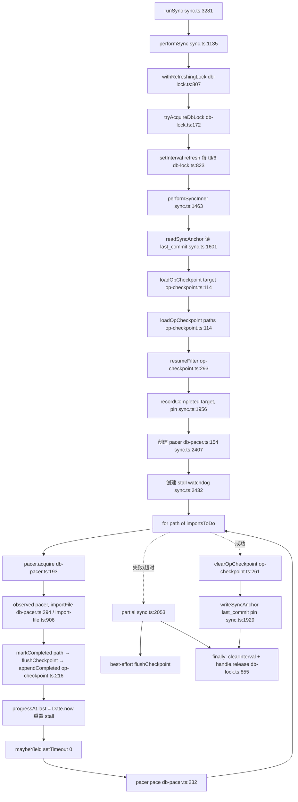

# gbrain sync 可恢复导入模块深读笔记（模板场景二）

> 模块：sync 可恢复导入链路，聚焦 per-source lock + checkpoint + pace mode + stall watchdog 四机制
> 仓库：gbrain v0.42.56.0
> 性质：中间产物，不入 `知识库/经验/`，与 `gbrain-代码地图.md` 同级

---

## 1. 模块背景

`gbrain sync` 把一个 source 的本地 markdown 文件批量导入 brain：解析 frontmatter → page upsert → link extract → chunk → 可选 auto-embed。一次 sync 可能跑几十分钟到几小时，期间会撞上 PgBouncer transaction pool 耗尽、进程被 SIGTERM、DB 瞬态故障、单文件 import hang 等问题。

本模块的核心问题不是"怎么导入"，而是"导入被打断后怎么不丢工作、不重做、能续跑"。本次深读聚焦四个机制：per-source lock（每源锁）、checkpoint（断点续传）、pace mode（DB 争用节制）、stall watchdog（停滞看门狗）。

CLAUDE.md 的"Sync resumability + lock tuning"表列了 6 个 env 钩子，本次深读把它们在代码里的实际读取位置全部确认了一遍，并发现一处文档误差：CLAUDE.md 提到的 `sync-lock.ts` / `sync-checkpoint.ts` 文件名在仓库中**不存在**，锁实现在 `src/core/db-lock.ts`，checkpoint 实现在 `src/core/op-checkpoint.ts`（generic 名，不是 sync 专属）。

## 2. 核心职责

负责：

- 单源 / 多源（`--all`）批量导入文件，per-source 串行或受控并发
- 跨进程跨主机的锁，防止两个 sync 抢同一 source
- 断点续传：被 kill 后下次 `gbrain sync` 从上次完成的文件继续，不重做
- DB 争用节制：可选 pacing，避免 embed-backfill 与 sync 互相打死 PgBouncer
- 停滞看门狗：检测"进程活着但 import 不前进"的 wedge，主动 abort 释放锁

不负责：

- 单文件的 markdown 解析 / page upsert / chunk 切分（这是 `import-file.ts` 的事）
- embed 向量化（这是 `embed-backfill-lock.ts` 协调的独立流程）
- schema 迁移（migrate.ts）
- 失败文件账本（`sync-failure-ledger.ts`，与本四机制无直接关系）

## 3. 核心对象

### 主入口与编排

| 对象 | 文件:行号 | 作用 |
|---|---|---|
| `runSync` | `src/commands/sync.ts:3281` | CLI `gbrain sync` 的分发入口 |
| `performSync` | `src/commands/sync.ts:1135` | 单源 sync 主函数，包 `withRefreshingLock` |
| `performSyncInner` | `src/commands/sync.ts:1463` | 锁内执行体，组装 checkpoint + pace + stall + 主循环 |
| `syncOneSource` | `src/commands/sync.ts`（被 runSync 调） | 单源 wrapper |

### A. per-source lock

| 对象 | 文件:行号 | 签名/作用 |
|---|---|---|
| `syncLockId` | `src/core/db-lock.ts:722` | `(sourceId): string`，返回 `gbrain-sync:${sourceId}` |
| `tryAcquireDbLock` | `src/core/db-lock.ts:172` | `(engine, lockId, ttlMinutes?): Promise<DbLockHandle \| null>`，upsert + ON CONFLICT WHERE TTL 过期 + heartbeat grace |
| `withRefreshingLock` | `src/core/db-lock.ts:807` | `<T>(engine, lockId, work, opts?): Promise<T>`，包 setInterval 心跳 |
| `resolveStealGraceSeconds` | `src/core/db-lock.ts:58` | `(ttlMinutes): number`，读 `GBRAIN_LOCK_STEAL_GRACE_SECONDS` |
| `handle.refresh()` | `src/core/db-lock.ts:236` | 走 `engine.executeRawDirect`（direct session pool，绕开 Supavisor transaction pool） |
| `reapDeadHolderLocks` | `src/core/db-lock.ts` | 死 holder 清理 |
| `liveSyncStatus` | `src/core/db-lock.ts:749` | 锁状态查询 |

### B. checkpoint

| 对象 | 文件:行号 | 签名/作用 |
|---|---|---|
| `syncFingerprint` | `src/core/op-checkpoint.ts:476` | `(p: { sourceId?; lastCommit }): string`，sha8 over canonical-JSON of `{mode:'sync', source, lastCommit}` |
| `loadOpCheckpoint` | `src/core/op-checkpoint.ts:114` | `(engine, key): Promise<string[]>`，UNION ALL 三段：op_checkpoint_paths + legacy JSONB + corrupt 探测 |
| `appendCompleted` | `src/core/op-checkpoint.ts:216` | `(engine, key, deltaKeys): Promise<boolean>`，ADDITIVE 追加，单 CTE 写 parent + unnest 写 children |
| `appendCompletedOnce` | `src/core/op-checkpoint.ts:239` | SIGTERM 路径无重试单次写 |
| `clearOpCheckpoint` | `src/core/op-checkpoint.ts:261` | 完整成功后清 |
| `durableWrite` | `src/core/op-checkpoint.ts:35` | 包 `withRetry(BULK_RETRY_OPTS)`，`RetryAbortError` 重抛 |
| `resumeFilter` | `src/core/op-checkpoint.ts:293` | 纯函数过滤已完成的路径 |
| `purgeStaleCheckpoints` | `src/core/op-checkpoint.ts:489` | 7 天 TTL GC，cycle 的 purge 阶段调用 |

sync.ts 侧闭包：

| 对象 | 文件:行号 | 作用 |
|---|---|---|
| `flushCheckpoint` | `src/commands/sync.ts:1983` | 触发条件满足时调 `appendCompleted` |
| `markCompleted` | `src/commands/sync.ts:2019` | 单文件完成后调 |
| `partial` | `src/commands/sync.ts:2053` | 失败/超时收尾，best-effort flush |
| `recordCompleted` | `src/commands/sync.ts` | 写 pinned target |
| `writeSyncAnchor` | `src/commands/sync.ts:1929` | 完整成功后推进 `last_commit` |

### C. pace mode

| 对象 | 文件:行号 | 签名/作用 |
|---|---|---|
| `createDbPacer` | `src/core/db-pacer.ts:154` | `(opts: CreateDbPacerOpts): DbPacer`，计数信号量 + EWMA + 抖动 sleep |
| `createNoopPacer` | `src/core/db-pacer.ts:135` | off / PGLite 用 |
| `acquire` | `src/core/db-pacer.ts:193` | `(signal?): Promise<Permit>`，超 max 入 waiters 队列 |
| `observe` | `src/core/db-pacer.ts:222` | `(latencyMs): void`，EWMA: `alpha*x + (1-alpha)*ewma`，默认 alpha=0.3 |
| `pace` | `src/core/db-pacer.ts:232` | `(signal?): Promise<void>`，`min(maxSleepMs, ewma) * (0.5..1.0 抖动)` |
| `observed` | `src/core/db-pacer.ts:294` | `<T>(pacer, fn): Promise<T>`，计时 + observe 一站式 |
| `resolvePaceMode` | `src/core/pace-mode.ts:142` | 纯函数，perCall → env → config → bundle |
| `readPaceEnv` | `src/core/pace-mode.ts:216` | 读 `GBRAIN_PACE_*` env |
| `loadPaceModeConfig` | `src/core/pace-mode.ts:266` | 读 config 表 |

### D. stall watchdog

| 对象 | 文件:行号 | 作用 |
|---|---|---|
| `progressAt` | `src/commands/sync.ts:2433` | `{ last: Date.now() }` 闭包变量，前进进度时重置 |
| `stallController` | `src/commands/sync.ts:2438` | `new AbortController()`，abort 信号合成进 `opts.signal` |
| stall setInterval | `src/commands/sync.ts:2439` | 每 `min(5000, stallMs)` 检查一次 |
| `composeAbortSignals` | `src/commands/sync.ts:2451` | 把 stallController.signal 合成进 opts.signal |
| `resolveStallAbortSeconds` | `src/commands/sync.ts:3205` | 读 `GBRAIN_SYNC_STALL_ABORT_SECONDS`，默认 900 |

## 4. 内部流程

### 单源主调用链



### 多源（`--all`）调用链

`runSync` → `runOne` 闭包（sync.ts:3666）→ `withSourcePrefix + performSync`（sync.ts:3717），后续同单源。并发执行用 `pMapAllSettled(activeSources, cap, runOne)`（sync.ts:3805），串行执行 `for src of activeSources: await runOne(src)`（sync.ts:3834）。

### 四机制组装顺序

**lock (A，外层 withRefreshingLock) → checkpoint load (B) → pace (C) → stall (D)**，都在 `performSyncInner` 内（sync.ts:1463）。A 在外层包裹，B/C/D 在内层并行存在。

## 5. 对外接口

### CLI

- `gbrain sync` → `runSync`（sync.ts:3281）
- `gbrain sync --all` → 多源并发/串行
- `gbrain sync --source <slug>` → 单源
- env 钩子：`GBRAIN_SYNC_*` 6 个（详见第 7 节）、`GBRAIN_PACE_*` 4 个

### 给 embed-backfill 的协调

- `embedBackfillLockId`（`src/core/embed-backfill-lock.ts`）与 `syncLockId` 独立，但 embed `--stale` 单飞用同一个 per-source lock key，防 hand-run backfill 与 queued job race（CLAUDE.md TODOS:2299）

### 不对外暴露

- `withRefreshingLock` 是 generic 的，cycle 也用同一套锁（命名空间 `gbrain-cycle:` 而非 `gbrain-sync:`）
- `loadOpCheckpoint` / `appendCompleted` 是 generic 的，op 名为 `'sync'` 只是其中一个 caller；其他长任务（如 reindex）理论上也能用

## 6. 扩展点

新增一个 sync env 钩子要改的地方：

1. `src/commands/sync.ts` 顶部加 `resolveXxx()` 函数（参考 `resolveSyncCheckpointEvery` sync.ts:128）
2. 加 `XXX_DEFAULT` 常量
3. 在 `performSyncInner` 内的对应位置读取
4. CLAUDE.md sync 表加一行

新增一个 pace mode bundle 要改的地方：

1. `src/core/pace-mode.ts` 的 `PACE_BUNDLES` 加一项（参考 `:64-93` 的 gentle/balanced/aggressive）
2. `resolvePaceMode` 的 fallback 逻辑加新 mode
3. CLI `--pace=<mode>` 的解析接受新值

新增一个 checkpoint 用户（非 sync）要改的地方：

1. `src/core/op-checkpoint.ts` 的 `syncFingerprint` 是 sync 专属，新用户写自己的 fingerprint 函数
2. 用 `loadOpCheckpoint` / `appendCompleted` / `clearOpCheckpoint` 三件套，key 用自己的 `op` 名
3. 注意 `appendCompleted` 走 `unnest($3::text[])` 而非 `$3::jsonb`，绕开 postgres.js 双重编码 bug（详见第 9 节候选 8）

新增一个 stall 类看门狗（其他长任务复用）要改的地方：

1. 参考 sync.ts:2432-2451 的 `progressAt` + `setInterval` + `AbortController` 模式
2. 关键是选对"进度信号"——sync 用文件级进度而非 lock 心跳（详见第 9 节候选 3）
3. abort signal 合成进 opts.signal，让下游 `pacer.acquire` / `pacer.pace` 也能感知

## 7. 错误处理

### 6 个 env 钩子的实际读取位置

| Env 变量 | 读取位置 | 默认值 | 上下文 |
|---|---|---|---|
| `GBRAIN_SYNC_CHECKPOINT_EVERY` | `src/commands/sync.ts:128` | 1000 | `resolveSyncCheckpointEvery()`，每 N 条 flush |
| `GBRAIN_SYNC_CHECKPOINT_SECONDS` | `src/commands/sync.ts:140` | 10 | `resolveSyncCheckpointSeconds()`，时间触发 flush 上限 |
| `GBRAIN_SYNC_MAX_CHECKPOINT_FAILURES` | `src/commands/sync.ts:152` | 3 | `resolveSyncMaxCheckpointFailures()`，连续失败上限，达到即 `checkpointDead=true` |
| `GBRAIN_SYNC_YIELD_EVERY` | `src/commands/sync.ts:168` | 64 | `resolveSyncYieldEvery()`，每 N 文件 `setTimeout(0)` 让心跳定时器触发 |
| `GBRAIN_LOCK_STEAL_GRACE_SECONDS` | `src/core/db-lock.ts:59` | 600（或 `max(floor(refreshSec*2), 60)`，refreshSec = `max(15, ttl*60/6)`） | `resolveStealGraceSeconds(ttlMinutes)`，heartbeat-aware steal 宽限 |
| `GBRAIN_SYNC_STALL_ABORT_SECONDS` | `src/commands/sync.ts:3208` | 900 | `resolveStallAbortSeconds(env)`，无前进进度看门狗，`<=0` 禁用 |

### A. lock 续期失败：降级，不中断

`src/core/db-lock.ts:823-847`（setInterval 回调）+ `:841-845`（catch 块）：

```ts
// db-lock.ts:841-845
} catch (err) {
  const msg = err instanceof Error ? err.message : String(err);
  process.stderr.write(`[lock-refresh] ${lockId}: ${msg}; will retry next tick\n`);
  healthOk = false;
}
```

行为：单次 refresh 失败只写 stderr + 置 `healthOk=false`，**不清 clearInterval**，下一 tick 继续重试。TTL 是最终兜底——如果 pool 真的死了，TTL 过期后 steal 是正确的。注释在 `db-lock.ts:826-835` 明确说："我们不再把 renewal 门控在 read-pool 健康上，也不在瞬时失败时 clearInterval"。

work() 抛错时的 finally（`db-lock.ts:855-863`）：`clearInterval(interval)` + `handle.release()`（吞错），再检查 `healthOk` 写一条 degraded 日志。

### B. checkpoint 写失败达到 MAX_CHECKPOINT_FAILURES：置标志位，循环退出，partial 报告

`src/commands/sync.ts:1991-2002`（flushCheckpoint）+ `:1998`（计数）+ `:2073`（reason 覆盖）：

```ts
// sync.ts:1991-2002
const ok = await appendCompleted(engine, ckpt.paths, batch);
if (ok) {
  consecutiveFlushFailures = 0;
  bankedFiles += batch.length;
} else {
  // 未持久化——重新合并，下次 flush 重试
  for (const p of batch) pendingCheckpointPaths.add(p);
  if (++consecutiveFlushFailures >= maxFlushFailures) checkpointDead = true;
}
```

行为：失败时把 batch **重新合并回 pendingCheckpointPaths**（不丢），连续失败计数 +1，达到 `maxFlushFailures`（默认 3）置 `checkpointDead=true`。后续：

- `sync.ts:2593` 并行 worker 循环条件 `if (opts.signal?.aborted || checkpointDead) break;`
- `sync.ts:2654-2656` post-loop 检查：`if (checkpointDead) return await partial('timeout');`
- `sync.ts:2073` partial 把 reason 覆盖成 `'checkpoint_unavailable'`：`reason: checkpointDead ? 'checkpoint_unavailable' : reason`

注意：`checkpointDead` 是**标志位不是 throw**。注释 `sync.ts:1967-1969` 说明："importOnePath 的 per-file catch 会吞掉 throw，所以用 FLAG"。

pin 写失败（run 起步就失败）走 `sync.ts:2081-2084`：`pinPersisted=false` → `checkpointDead=true` → `partial('timeout')`，零损失，下次重试整个范围。

### C. stall watchdog 触发：释放 lock，保留 checkpoint，不推进 last_commit

`src/commands/sync.ts:2439-2447`（触发）+ `:2444-2446`（日志）+ `:2451`（合成 signal）：

```ts
// sync.ts:2439-2447
stallTimer = setInterval(() => {
  if (Date.now() - progressAt.last >= stallMs) {
    serr(`[sync] no import progress for ${stallSeconds}s — aborting (stall watchdog). ` +
        `The per-source lock will release; the next 'gbrain sync' resumes from the checkpoint.`);
    stallAborted = true;
    stallController.abort();
  }
}, Math.min(5000, stallMs));
```

行为链：

1. `stallController.abort()` → 合成进 `opts.signal`（`sync.ts:2451`）
2. import 主循环在 per-iteration 检查点看到 `opts.signal?.aborted` → `return await partial(stallAborted ? 'stall_timeout' : 'timeout')`（`sync.ts:2557` 串行 / `2621` 并行 / `2645` post-loop）
3. `partial()` 在 `sync.ts:2055-2057` best-effort flush 未 flush 的 checkpoint（`if (!checkpointDead) try { await flushCheckpoint(); }`）
4. `withRefreshingLock` 的 finally（`db-lock.ts:855-857`）`clearInterval + handle.release()` → **lock 释放**
5. `last_commit` 不推进（partial 不调 `writeSyncAnchor('last_commit', ...)`），下次 `gbrain sync` 从 checkpoint resume

关键：stall 触发后 **lock 释放、checkpoint 保留、last_commit 不动**。日志 `sync.ts:2443` 明确告诉操作员"per-source lock will release; next sync resumes from the checkpoint"。

限制（`sync.ts:2422-2430`）：abort 只在**文件之间**被观察到，单个 importFile 内部的 hang 不会被中断，只能等它返回或等 wall-clock hard deadline 兜底。

### D. pace mode 失败：fail-open

`sync.ts:2397-2410` 创建 pacer 时若失败 `createNoopPacer()`。`pacer.acquire` / `pacer.pace` 抛 `AbortError`（取消）会传播，其他错误 fail-open（CLAUDE.md 明确："a pacer bug never kills a backfill, never throws an unhandledRejection"）。

## 8. 设计优点

每条都有代码证据，不用形容词：

1. **lock 心跳间隔 `ttl/6`（30min TTL→5min）的 6x 余量**（db-lock.ts:816 `refreshIntervalMs = max(15000, ttl*60*1000/6)`）。代码证据：6x 保证漏一个 tick 也不会过期，同时不会把 direct pool 打爆。改更短→pool 压力；改更长→漏两个 tick 就可能被 steal。

2. **checkpoint flush 三选一触发条件，`firstFile` 单独存在**（sync.ts:2022-2025 `dueByCount || dueByTime || firstFile`）。代码证据：第一条文件后必 flush（`completed.size === 1`），之后"每 N 条 OR 每 N 秒"先到先触发。`firstFile` 单独存在是为了让 kill-resume 的第一次 flush 尽早落地，哪怕 N=1000 还没到。

3. **stall watchdog 用文件级进度（`progressAt.last`）而非 lock 心跳**（sync.ts:2412-2431 注释）。代码证据：事故是"sync 卡 29min 但 lock 心跳一直在 refresh"——心跳只证明进程活着，不证明 import 在前进。用心跳会漏掉这种 wedge。代价：单文件内部 hang 观察不到（sync.ts:2422-2430），只能靠 wall-clock hard deadline 兜底。

4. **checkpoint 写走 direct pool 而非 transaction pool**（op-checkpoint.ts:26-34 + db-lock.ts:233-235）。代码证据：Supavisor transaction-pooler 耗尽（EMAXCONNSESSION/SQLSTATE 53300）时，import worker 和 checkpoint 写竞争同一个死池子。direct pool 绕开，+withRetry 骑过 5-10s 恢复窗。如果 checkpoint 也走 transaction pool，pool 一死 checkpoint 永远写不进去，import 白干。

5. **fingerprint 只编码 (sourceId, lastCommit) 不编码 target/HEAD**（op-checkpoint.ts:469-475）。代码证据：lastCommit 是 anchor，只在完整成功时推进，所以 kill-resume 期间 key 稳定。如果编码 HEAD，enrich 每小时 commit 一次会让 checkpoint key 每小时变一次，resume 失效——正是这个 bug 要修的。

6. **`checkpointDead` 用 FLAG 而不是 throw**（sync.ts:1967-1969）。代码证据：importOnePath 有 per-file try/catch（sync.ts:2523-2529），throw 会被吞掉当成单文件失败继续跑。用标志位让循环条件 `if (checkpointDead) break`（sync.ts:2593）和 post-loop 检查 `if (checkpointDead) return partial`（sync.ts:2654）显式生效。

7. **pace mode 把 env 放在 config 之上的设计**（pace-mode.ts:8-9 "ENV ABOVE CONFIG so GBRAIN_PACE_* is a real incident escape hatch"）。代码证据：生产 config 写死了 balanced，事故时操作员直接 `GBRAIN_PACE_MODE=aggressive` 或 `GBRAIN_PACE_MAX_CONCURRENCY=4` 临时覆盖，不用 redeploy。与 search mode（env 在 config 下）相反，因为 pace 是事故旋钮。

8. **checkpoint flush 失败时 batch 重新合并回 pending，不丢**（sync.ts:1996-1998 `for (const p of batch) pendingCheckpointPaths.add(p);`）。代码证据：失败不删 batch，下次 flush 重试。配合 `checkpointDead` 标志位，要么成功 flush 要么显式 partial，不会出现"以为 flush 了其实丢了"的静默数据丢失。

## 9. 设计代价

1. **`sync.ts` 单文件 4500+ 行**，performSyncInner 内部主循环嵌套深。新人要追"一个文件怎么从 import 到 checkpoint 写入"需要在 5 个函数之间跳读。代价是换来四机制在同一作用域内共享闭包变量（progressAt、pendingCheckpointPaths、checkpointDead）。

2. **CLAUDE.md 与代码的术语偏差**。CLAUDE.md 提 `sync-lock.ts` / `sync-checkpoint.ts`，实际是 `db-lock.ts` / `op-checkpoint.ts`（generic 名）。这种偏差会让按文档找文件的人扑空。代价是文档需要随重构同步更新，但 generic 命名换来 cycle/embed-backfill 等其他长任务复用同一套原语。

3. **stall watchdog 单文件 hang 观察不到**（sync.ts:2422-2430）。代码证据：abort 只在文件之间被观察。如果一个 importFile 内部 hang（比如 deadlocked SQL），stall 看门狗触发后只能等 wall-clock hard deadline 兜底，单文件 hang 期间锁不释放。代价是换来了"不在 importFile 内部插入 abort check 点"的简洁性。

4. **pace EWMA 是进程内闭包变量，跨 sync 不共享**（db-pacer.ts:167 `let ewma: number | null = null`）。代码证据：单次 performSyncInner 内创建（sync.ts:2407），finally `dispose()`（sync.ts:2629），进程结束即消失。代价是两次相邻 sync 不能复用 EWMA 样本，每次都从冷启动开始观察。

5. **JSONB 双重编码陷阱需要结构性防护**。代码证据：sync 用 `appendCompleted`（`unnest($3::text[])`）而不是 `recordCompleted`（`$3::jsonb`），正是为了绕开 postgres.js 在 `.unsafe()` 路径下把 JS string 双重编码成 jsonb string scalar 的 bug（op-checkpoint.ts:183-192）。代价是 sync 路径不能用 jsonb 数组绑定的便利，必须用 unnest text[] 形式。详见 CLAUDE.md JSONB invariant。

## 10. 可提炼候选

| # | 候选 | 层级 | 衔接 |
|---|---|---|---|
| 1 | lock 心跳间隔为什么是 `ttl/6` 而不是更激进/更保守 | 原子层 | 新方案《DB 锁的心跳间隔与 steal grace 设计》阶段 1 |
| 2 | checkpoint flush 触发条件三选一：count/time/firstFile 的优先级 | 原子层 | 新方案《批量任务的 checkpoint flush 策略》阶段 1 |
| 3 | stall watchdog 用文件级进度而非 lock 心跳的原因 | 原子层 | 新方案《长任务的进度感知看门狗》阶段 1 |
| 4 | checkpoint 写走 direct pool 而非 transaction pool 的原因 | 原子层 | 新方案《池化 DB 的 direct pool 逃生路径》阶段 1 |
| 5 | fingerprint 只编码 (sourceId, lastCommit) 不编码 target/HEAD | 原子层 | 新方案《checkpoint key 的稳定anchor 选择》阶段 1 |
| 6 | `checkpointDead` 用 FLAG 而不是 throw（被 per-file catch 吞掉的语义） | 原子层 | 新方案《循环内失败信号传播：FLAG vs throw》阶段 1 |
| 7 | pace mode 把 env 放在 config 之上的设计（与 search mode 相反） | 原子层 | 新方案《事故旋钮的 env 高于 config 约定》阶段 1 |
| 8 | JSONB 双重编码陷阱的 checkpoint 侧防护（用 unnest text[] 绕开） | 原子层 | 补全已有 JSONB invariant 的具体落地案例 |

候选 1+3+4 串起来可以做一个完整方案《DB 锁的心跳与看门狗》，分 3 个阶段。
候选 2+5+6 串起来可以做一个完整方案《批量任务的可恢复 checkpoint》，分 3 个阶段。
候选 7+8 是独立的原子卡，分别补全 pace mode 和 JSONB invariant 的具体落地。

这五条方案都直接补全总目录"下一步计划"里"Sync 可恢复导入"未做项。

## 11. 已读证据

实际打开过（Read 工具）的文件：

| 文件 | 范围 |
|---|---|
| `src/commands/sync.ts` | 4500+ 行，分段读了 1-220、1135-1356、1463-1582、1700-1789、1955-2084、2380-2660、3180-3480、3600-3700、3780-3870、3960-4040、4129-4227；grep 覆盖全文 |
| `src/core/db-lock.ts` | 全文 929 行 |
| `src/core/op-checkpoint.ts` | 全文 512 行 |
| `src/core/db-pacer.ts` | 全文 306 行 |
| `src/core/pace-mode.ts` | 全文 287 行 |
| `src/core/sync.ts` | 全文 523 行（确认是纯函数工具，不是可恢复导入链路本体） |
| `src/core/embed-backfill-lock.ts` | 全文 17 行 |
| `src/core/pglite-schema.ts` | 读了 596-609 锁表、940-992 checkpoint 表 |

## 12. 待深读问题

1. `src/core/sync-delta.ts` —— `computeSyncDelta` / `buildDetachedWorkingTreeManifest`，决定 lastCommit..pin 的 manifest 怎么算（sync.ts:23 import，1737 用）
2. `src/core/sync-concurrency.ts` —— `autoConcurrency` / `shouldRunParallel` / `parseWorkers` / `resolveMaxConnections`，决定 worker 数和并行策略（sync.ts:48 import）
3. `src/core/sync-failure-ledger.ts` —— 失败文件账本，sync.ts:484-513 大量 re-export，失败分支会写这里
4. `src/core/retry.ts` —— `withRetry` / `BULK_RETRY_OPTS` / `RetryAbortError`，checkpoint 和 lock refresh 的重试策略来源（op-checkpoint.ts:3 import）
5. `src/core/process-cleanup.ts` —— `registerCleanup`，SIGTERM 时 `appendCompletedOnce` 注册在这里（op-checkpoint.ts:239 提到，sync.ts 注册 `deregisterCheckpointCleanup`）
6. `src/core/abort-check.ts` —— `AbortError` / `anySignal`，pace 和 stall 都依赖（db-pacer.ts:33 import）
7. `src/core/migrate.ts` 的 v67/v97/v98/v115/v119 迁移条目 —— schema 演进史，v98 加 `last_refreshed_at`，v115 加 `op_checkpoint_paths`，v119 加 `completed_keys_array` CHECK 约束
8. `src/core/postgres-engine.ts` 的 `executeRawDirect` 实现 —— direct pool vs transaction pool 的实际分流
9. `src/core/import-file.ts` —— 单文件导入实现（importFile = importFromFile），sync 主循环调它但本次未读内部
10. `src/core/ingestion/` 目录 —— chunk 切分、link extract 等 ingestion 子模块，sync 间接调用

---

*生成依据：《开源项目工程经验提炼提示词模板》场景二。未经场景五审查，不作为经验库条目入库。*