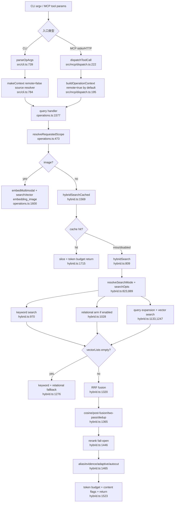

# gbrain query 链路源码精读报告

> 文档类型：源码精读报告  
> 目标仓库：`gbrain`  
> 版本快照：`0.42.56.0`，证据来自 `package.json:134` 与当前工作区源码  
> 范围：从 CLI / MCP 入口到 `query` 检索返回，覆盖全局地图、主流程、关键机制、复盘经验  
> 说明：末尾不设置问答环节

---

## 0. 阅读边界

本报告只覆盖“查询检索”主线：`gbrain query` / MCP `query` tool 如何进入 `operations.ts`，如何走 `hybridSearchCached`，再进入 `hybridSearch` 组织关键词、向量、关系召回、RRF 融合和后处理。

证据不足的范围：

- 没有展开 `gbrain think` 的答案合成链路；这里只读到 `query` 返回 `SearchResult[]`。
- 没有展开 `sync` / `import` / `dream` / `minions` 的后台写入链路。
- 没有全文阅读 `admin/` 前端；HTTP MCP 只读到工具分发与 scope 校验。

---

## Phase 1：建立全局地图

### 1. 一句话定位

GBrain 把个人或团队的 Markdown / 知识库内容放进本地或远程 Postgres 形态的“脑”里，让 CLI 和 Agent 都能按来源权限检索出相关片段，再交给上层生成带证据的回答。

代码证据：

- 包描述直接写成 `Postgres-native personal knowledge brain with hybrid RAG search`：`package.json:3`。
- CLI 二进制名 `gbrain` 指向 `src/cli.ts`：`package.json:6-7`。
- MCP 工具列表由 `operations` 自动生成：`src/mcp/server.ts:24-29`。

### 2. 技术栈与核心依赖

| 类别 | 结论 | 代码证据 |
|---|---|---|
| 语言 / 模块 | TypeScript ESM | `package.json:4` 声明 `"type": "module"`；`package.json:5` 将主入口指向 `src/core/index.ts` |
| 运行时 / 构建 | Bun | `package.json:33` 的 build 命令为 `bun build --compile --outfile bin/gbrain src/cli.ts` |
| 默认嵌入式 DB | PGLite | `package.json:107` 依赖 `@electric-sql/pglite`；`src/core/engine-factory.ts:12-15` 动态加载 `PGLiteEngine` |
| 生产 / 远程 DB | Postgres | `package.json:125` 依赖 `postgres`；`src/core/engine-factory.ts:16-19` 动态加载 `PostgresEngine` |
| Agent 协议 | MCP | `package.json:110` 依赖 `@modelcontextprotocol/sdk`；`src/mcp/server.ts:18-29` 创建 MCP server 并暴露 tools |
| HTTP 服务 | Express | `package.json:117-118` 依赖 `express` 和 `express-rate-limit`；`src/commands/serve-http.ts:1472-1513` 为每次请求创建 MCP server 并返回 tool schema |
| AI 网关 | Vercel AI SDK + OpenAI / Anthropic SDK | `package.json:100-104` 与 `package.json:111,123` |
| 运行时校验 | Zod | `package.json:128` |

### 3. 核心模块地图

| 模块 | 职责 | 关键文件 | 依赖关系 |
|---|---|---|---|
| CLI 入口 | 解析命令、区分 CLI-only 与共享 operation、连接引擎、构造本地 `OperationContext` | `src/cli.ts:37-47`、`src/cli.ts:292-360`、`src/cli.ts:2079-2175` | 依赖 `config`、`engine-factory`、`operations`；被 `package.json` 的 `bin.gbrain` 调用 |
| Operation 契约层 | 定义工具参数、权限 scope、处理函数，是 CLI / MCP 的单一共享契约 | `src/core/operations.ts:277-394`、`src/core/operations.ts:589-606`、`src/core/operations.ts:1478-1710` | 被 CLI、MCP stdio、HTTP MCP 调用 |
| MCP stdio / HTTP | 把 operation 映射成 MCP tools，远程调用固定走 `remote: true`，HTTP 增加 OAuth scope 与审计 | `src/mcp/server.ts:18-54`、`src/mcp/dispatch.ts:195-270`、`src/commands/serve-http.ts:1449-1638` | 依赖 `operations`、`dispatchToolCall`、`scope.ts` |
| 引擎抽象 | 用一个 `BrainEngine` 接口承接 PGLite / Postgres 双实现 | `src/core/engine.ts:649-666`、`src/core/engine.ts:927-943`、`src/core/engine-factory.ts:8-25` | 被 CLI connect、operation handler、search 模块依赖 |
| 搜索主干 | 组织搜索模式解析、关键词召回、向量召回、关系召回、RRF 融合、rerank、autocut、token budget | `src/core/search/hybrid.ts:809-1545`、`src/core/search/hybrid.ts:1569-1775`、`src/core/search/mode.ts:285-435` | 依赖 `BrainEngine.searchKeyword/searchVector`、AI gateway、mode config |
| 搜索模式 / 缓存指纹 | 将 `conservative/balanced/tokenmax` 映射为具体 knobs，并用 `knobsHash` 隔离缓存 | `src/core/search/mode.ts:285-435`、`src/core/search/mode.ts:571-639`、`src/core/search/mode.ts:785-870` | 被 `hybridSearch` 与 `hybridSearchCached` 同时调用 |
| Source 路由 | CLI 侧解析 `--source` / env / dotfile / local_path / default，operation 侧解析权限范围 | `src/core/source-resolver.ts:80-160`、`src/core/operations.ts:417-493` | CLI `makeContext` 调用 source resolver；operation handler 将 scope 传给 search |
| 存储后端 SQL | 在关键词和向量 SQL 候选阶段执行 source / type / date / modality 等过滤 | `src/core/postgres-engine.ts:1539-1625`、`src/core/postgres-engine.ts:1812-1895`、`src/core/pglite-engine.ts:1506-1595`、`src/core/pglite-engine.ts:1830-1905` | 被 `hybridSearch` 通过 `engine.searchKeyword/searchVector` 调用 |

### 4. 入口与启动流程

#### CLI 查询入口

1. `package.json:6-7` 把命令 `gbrain` 指到 `src/cli.ts`。
2. `src/cli.ts:37-44` 从 `operations` 中读取 `cliHints.name`，构造 CLI 命令到 operation 的映射表。
3. `src/cli.ts:46-47` 定义大量 CLI-only 命令；`query` 不在 CLI-only 集合里，所以走共享 operation。
4. `src/cli.ts:304-317` 用 `cliOps.get(command) ?? cliAliases.get(command)` 找到 operation，再调用 `parseOpArgs`。
5. `src/cli.ts:354-365` 如果是 thin-client，非 `localOnly` operation 走远程 `callRemoteTool`。
6. `src/cli.ts:368-439` 本地路径调用 `connectEngine()`、`makeContext()`，read-scope operation 会被 `withTimeout` 包住。
7. `src/cli.ts:423-439` 调用 `op.handler(ctx, params)`。

`parseOpArgs` 的参数转换很直接：`--foo-bar` 转成 `foo_bar`，boolean 直接写 `true`，number 用 `Number()`，位置参数按 `cliHints.positional` 填充，stdin 最大 5MB：`src/cli.ts:739-781`。

#### 引擎启动

1. `connectEngine()` 先读配置，缺失则提示 `gbrain init` 并退出：`src/cli.ts:2079-2084`。
2. 调用 `configureGateway(buildGatewayConfig(config))`，并明确写注释：AI gateway 必须在 engine connect 前配置，因为 `initSchema` 需要 embedding 维度：`src/cli.ts:2086-2089`。
3. `createEngine(toEngineConfig(config))` 根据 `engine` 动态 import PGLite 或 Postgres：`src/cli.ts:2091-2092`、`src/core/engine-factory.ts:8-25`。
4. `connectWithRetry(engine, toEngineConfig(config), { noRetry })` 建连接：`src/cli.ts:2093-2096`。
5. 非 probe 模式下调用 `tryRunPendingMigrations(engine)`，处理 pending migration / race / error 三类结果：`src/cli.ts:2106-2136`。
6. 连接后再次 `loadConfigWithEngine(engine, config)`，把 DB-plane config 合并回 gateway：`src/cli.ts:2138-2171`。配置优先级文档写在 `src/core/config.ts:597-608`：`env > file > DB > defaults`。

#### 初始化新脑

PGLite 初始化路径里，`runInit` 会在创建 schema 前先解决 embedding 维度，并强制先配置 gateway：

- embedding 维度 preflight：`src/commands/init.ts:797-822`
- `configureGateway` 必须在 `initSchema` 前：`src/commands/init.ts:828-840`
- 创建 PGLite engine 并 connect：`src/commands/init.ts:860-862`
- 检查既有 brain 的 embedding 维度是否冲突：`src/commands/init.ts:871-893`
- 调用 `engine.initSchema()`：`src/commands/init.ts:895`
- initSchema 后跑 search mode picker：`src/commands/init.ts:967-971`

### 5. 阅读优先级路线图

建议顺序：

1. `src/core/operations.ts:277-606`：先理解 `OperationContext`、`Operation`、`remote`、`scope`、`sourceId` 的契约。
2. `src/cli.ts:292-460` 与 `src/cli.ts:784-817`：看 CLI 怎么进入 operation，尤其是本地 `remote: false` 与 source resolver。
3. `src/mcp/dispatch.ts:195-270`、`src/mcp/server.ts:18-54`、`src/commands/serve-http.ts:1449-1638`：看 MCP 为什么默认是远程不可信路径。
4. `src/core/operations.ts:1478-1710`：读 `query` operation 的真实参数、分支、调用。
5. `src/core/search/hybrid.ts:1569-1775`：读缓存包装层。
6. `src/core/search/hybrid.ts:809-1545`：读 bare hybrid search 主体。
7. `src/core/search/mode.ts:285-435` 和 `src/core/search/mode.ts:571-639`：读 mode knob 怎么落成具体值。
8. `src/core/postgres-engine.ts:1539-1895`、`src/core/pglite-engine.ts:1506-1905`：验证过滤是否落到 SQL 层。

可以暂时不看：

- `admin/`：除非你要改 HTTP 管理台。
- `src/core/minions/`：除非你要读后台任务 / subagent 调度。
- `src/core/cycle/` 与 `src/commands/dream.ts`：除非你要读夜间维护流程。
- `evals/` 与大量 `test/`：初读先用主代码建立模型，再反查测试。

---

## Phase 2：追踪核心主流程

本报告选择的主流程：一次文本 `query` 从 CLI / MCP 输入到返回 `SearchResult[]`。

### 1. 流程入口

#### CLI 入口

CLI 输入示例：

```bash
gbrain query "retry budget"
```

真实入口链路：

- CLI 用 `operations` 里的 `cliHints` 建表：`src/cli.ts:37-44`
- `query` operation 的 `cliHints` 是 `{ name: 'query', positional: ['query'] }`：`src/core/operations.ts:1709-1710`
- `parseOpArgs` 将位置参数写入 `params.query`：`src/cli.ts:739-767`
- `makeContext` 解析 source，并设置 `remote: false`：`src/cli.ts:784-817`

#### MCP 入口

MCP tool 名称就是 operation 名称 `query`。stdio 入口：

- `startMcpServer` 用 `buildToolDefs(operations)` 生成工具列表：`src/mcp/server.ts:24-29`
- 工具调用走 `dispatchToolCall(engine, name, params, { remote: true, ... })`：`src/mcp/server.ts:36-54`

HTTP MCP 入口：

- 过滤掉 `localOnly` operation 后生成 tool list：`src/commands/serve-http.ts:1449`、`src/commands/serve-http.ts:1502-1513`
- 调用时先用 `hasScope(authInfo.scopes, requiredScope)` 做 scope 校验：`src/commands/serve-http.ts:1545-1551`
- 再调用 `dispatchToolCall(..., { remote: true, sourceId: tokenSourceId, auth: authInfo })`：`src/commands/serve-http.ts:1627-1638`

### 2. 输入参数与返回数据结构

`query` operation 的核心参数定义在 `src/core/operations.ts:1481-1576`，其中和文本查询主线最相关的是：

- `query`：字符串，文本查询；不是强制 required，因为也支持图片分支：`src/core/operations.ts:1482-1487`
- `limit / offset`：分页参数：`src/core/operations.ts:1493-1494`
- `expand`：是否启用多查询扩展，默认 `true`：`src/core/operations.ts:1495`
- `detail`：`low / medium / high`：`src/core/operations.ts:1496`
- `mode`：`conservative / balanced / tokenmax`，仅本地 trusted caller 可覆盖：`src/core/operations.ts:1497`
- `source_id`：覆盖 `OperationContext.sourceId`，远程 `__all__` 只能展开到授权 sources：`src/core/operations.ts:1535-1539`
- `embedding_column`：指定向量列：`src/core/operations.ts:1550-1554`
- `adaptive_return / autocut / relational`：控制返回集大小和关系召回：`src/core/operations.ts:1555-1575`

返回值是 `SearchResult[]`。关键字段见 `src/core/types.ts:674-709`：

- `slug / page_id / title / type`
- `chunk_text / chunk_source / chunk_id / chunk_index`
- `score / stale`
- `content_flag`
- `modality`
- `source_id`

查询参数下沉到搜索层后使用 `SearchOpts`。source 相关字段定义在 `src/core/types.ts:960-976`，embedding column 定义在 `src/core/types.ts:978-1000`。

### 3. 逐步追踪

#### Step 1：构造 `OperationContext`

CLI 路径：

- `makeContext` 调用 `resolveSourceId(engine, explicit)`：`src/cli.ts:791-795`
- 返回上下文中 `remote: false`：`src/cli.ts:807-809`
- `sourceId` 如果解析失败则退到 `'default'`：`src/cli.ts:811-815`

MCP 路径：

- `buildOperationContext` 默认 `remote: opts.remote ?? true`：`src/mcp/dispatch.ts:195-213`
- stdio MCP 显式传 `remote: true`，`sourceId` 来自 `GBRAIN_SOURCE` 或 `'default'`：`src/mcp/server.ts:43-50`
- HTTP MCP 显式传 `remote: true`，`sourceId` 来自 token：`src/commands/serve-http.ts:1616-1630`

输出：一个包含 `engine/config/logger/dryRun/remote/sourceId/auth` 的 `OperationContext`。

#### Step 2：`query` operation 解析 source scope 和图片分支

入口：`src/core/operations.ts:1577`

关键动作：

- `expand = p.expand !== false`，默认启用扩展：`src/core/operations.ts:1578-1580`
- 从 `p.query` / `p.image` / `p.image_mime` 取输入：`src/core/operations.ts:1581-1583`
- 读取 `embedding_column` 参数：`src/core/operations.ts:1584-1587`
- 调用 `resolveRequestedScope(ctx, sourceIdParam)` 得到 `{ sourceId }` 或 `{ sourceIds }`：`src/core/operations.ts:1588-1595`
- 如果传了 `image`，走 `embedMultimodal` + `ctx.engine.searchVector(... embedding_image ...)`，绕过 `hybridSearch`：`src/core/operations.ts:1597-1615`
- 如果文本和图片都没有，抛错：`src/core/operations.ts:1618-1620`

文本路径输出：调用 `hybridSearchCached(ctx.engine, queryText, opts)` 的参数对象。

#### Step 3：进入 `hybridSearchCached`

入口：`src/core/search/hybrid.ts:1569`

关键动作：

- 解析搜索模式和 per-call / config overrides：`src/core/search/hybrid.ts:1574-1614`
- 解析 embedding column，并判断缓存是否安全：`src/core/search/hybrid.ts:1615-1628`
- 用 `knobsHash` 把 mode、cache、tokenBudget、expansion、reranker、embedding column、graph signals、autocut、relational 等写进缓存指纹：`src/core/search/hybrid.ts:1629-1634`、`src/core/search/mode.ts:785-870`
- 构造 `SemanticQueryCache`，阈值和 TTL 来自 resolved mode：`src/core/search/hybrid.ts:1636-1646`
- 决定是否跳过缓存。以下情况跳过：cache disabled、`walkDepth > 0`、`nearSymbol`、非默认 embedding column、adaptive return 开启：`src/core/search/hybrid.ts:1648-1665`
- 如果能查缓存，先 bounded embed 查询文本，然后 `cache.lookup(queryEmbedding, { sourceId: cacheScopeKey(opts), knobsHash })`：`src/core/search/hybrid.ts:1671-1710`
- 命中后 slice、token budget、emit meta，然后返回：`src/core/search/hybrid.ts:1710-1749`
- miss 或 disabled 时调用 bare `hybridSearch`：`src/core/search/hybrid.ts:1753-1769`

#### Step 4：进入 bare `hybridSearch`

入口：`src/core/search/hybrid.ts:809`

关键动作：

1. 解析 mode：
   - `loadSearchModeConfig(engine)` + `resolveSearchMode(...)`：`src/core/search/hybrid.ts:823-856`
   - 这一步必须在 bare `hybridSearch`，因为 eval replay 也直调 bare 函数：`src/core/search/hybrid.ts:819-822`

2. 解析 embedding column：
   - `loadConfigWithEngine(engine)`，然后 `resolveEmbeddingColumn(opts, cfg)`：`src/core/search/hybrid.ts:858-869`

3. 计算 limit：
   - `limit = opts?.limit || resolvedMode.searchLimit`
   - `innerLimit = Math.min(limit * 2, MAX_SEARCH_LIMIT)`：`src/core/search/hybrid.ts:871-873`

4. 识别 intent 并构造 `searchOpts`：
   - `classifyQuery(query)`：`src/core/search/hybrid.ts:875-884`
   - `searchOpts` 包含 `limit/detail/language/symbolKind/types/since/until/sourceId/sourceIds/embeddingColumn`：`src/core/search/hybrid.ts:886-919`

5. 关键词召回：
   - 非 image-only 时调用 `engine.searchKeyword(query, searchOpts)`：`src/core/search/hybrid.ts:955-970`

6. 关系召回：
   - 如果 `resolvedMode.relationalRetrieval` 为真，调用 `buildRelationalArm(engine, query, { sourceId, sourceIds, depth, limit })`：`src/core/search/hybrid.ts:1021-1036`

7. 无 embedding provider 的回退：
   - `isAvailable('embedding', providerProbe)` 为假时，只用 keyword + relational，经 RRF、post-fusion、alias hop、dedup、token budget 后返回：`src/core/search/hybrid.ts:1038-1070`

8. 扩展查询：
   - `expansionAllowed = resolvedMode.expansion && effectiveModality !== 'image'`
   - 调 `opts.expandFn(query)`，失败不终止搜索：`src/core/search/hybrid.ts:1133-1152`

9. 向量召回：
   - unified multimodal 分支：`src/core/search/hybrid.ts:1165-1203`
   - image / both 分支：`src/core/search/hybrid.ts:1205-1231`
   - text 分支：`embedQueryBounded` 后 `engine.searchVector`：`src/core/search/hybrid.ts:1241-1273`

10. embedding 失败回退：
    - `vectorLists.length === 0` 时 keyword + relational RRF，后续 post-fusion、alias hop、token budget 返回：`src/core/search/hybrid.ts:1276-1318`

11. 主路径融合：
    - 根据 intent 权重算 `keywordK` / `vectorK`：`src/core/search/hybrid.ts:1320-1329`
    - both 模式使用 text/image 两套权重：`src/core/search/hybrid.ts:1331-1347`
    - relational recall 作为第四臂加入 RRF：`src/core/search/hybrid.ts:1354-1361`
    - `rrfFusionWeighted(allLists, detail !== 'high')`：`src/core/search/hybrid.ts:1363`

12. 后处理：
    - cosine re-score：`src/core/search/hybrid.ts:1365-1371`
    - backlinks / salience / recency / graph signals：`src/core/search/hybrid.ts:1373-1384`
    - two-pass structural expansion，失败吞掉：`src/core/search/hybrid.ts:1387-1428`
    - `dedupResults`：`src/core/search/hybrid.ts:1436-1437`
    - `detail=low` 且 0 结果时重试 `detail=high`：`src/core/search/hybrid.ts:1439-1444`
    - reranker：`src/core/search/hybrid.ts:1446-1463`
    - alias hop：`src/core/search/hybrid.ts:1465-1471`
    - evidence stamp：`src/core/search/hybrid.ts:1473-1477`
    - adaptive return：`src/core/search/hybrid.ts:1479-1495`
    - autocut：`src/core/search/hybrid.ts:1497-1521`
    - slice + token budget + content flags + meta：`src/core/search/hybrid.ts:1523-1545`

### 4. 核心数据流转

```text
CLI argv / MCP params
  -> Record<string, unknown> params
  -> OperationContext + query params
  -> query operation branch
  -> HybridSearchOpts / SearchOpts
  -> engine.searchKeyword/searchVector SQL rows
  -> SearchResult[]
  -> RRF fused SearchResult[]
  -> reranked / deduped / budgeted SearchResult[]
  -> CLI formatter or MCP JSON content
```

几个重要转换点：

- CLI `--source-id` 不是直接拼 SQL，而是先变成 `params.source_id`，再由 `resolveRequestedScope` 变成 `{ sourceId }` 或 `{ sourceIds }`：`src/core/operations.ts:1588-1595`。
- mode 不是字符串传到底层，而是在 `resolveSearchMode` 中变成 `ResolvedSearchKnobs`：`src/core/search/mode.ts:571-639`。
- embedding column 不是 engine 读 config，而是在 `hybridSearch` 入口解析成 descriptor 传给 engine：`src/core/types.ts:978-1000`、`src/core/search/hybrid.ts:858-869`。
- 搜索结果统一用 `SearchResult`，含 chunk 级字段与 `source_id`：`src/core/types.ts:674-709`。

### 5. 分支与异常处理

| 场景 | 代码行为 | 证据 |
|---|---|---|
| 本地 read operation 卡死 | 默认 180000ms 超时，超时 exit verdict 124 | `src/cli.ts:380-404`、`src/cli.ts:423-437` |
| remote caller 传 `mode` | `resolvePerCallMode` 直接返回 undefined，使用服务端配置 | `src/core/operations.ts:543-553` |
| remote caller 请求越权 source | `resolveRequestedScope` 抛 `OperationError('permission_denied')` | `src/core/operations.ts:473-493` |
| 文本和图片都没传 | `query requires either query or image` | `src/core/operations.ts:1618-1620` |
| 图片查询 | bypass `hybridSearch`，直接 multimodal embed + `searchVector` on `embedding_image` | `src/core/operations.ts:1597-1615` |
| 缓存不安全 | skip cache，不查也不写 | `src/core/search/hybrid.ts:1648-1665` |
| cache lookup embed 失败 | `cacheStatus = 'disabled'`，继续 fresh search | `src/core/search/hybrid.ts:1684-1705` |
| expansion 失败 | catch 后保留原 query，不终止 | `src/core/search/hybrid.ts:1143-1151` |
| image-side embed 失败 | 打 warning，fall back to text-only | `src/core/search/hybrid.ts:1205-1230` |
| text embed 失败 | catch 后 `vectorLists` 为空，走 keyword fallback | `src/core/search/hybrid.ts:1247-1277` |
| two-pass expansion 失败 | catch 后继续 base hybrid retrieval | `src/core/search/hybrid.ts:1400-1428` |
| reranker 失败 | `applyReranker` 记录审计失败后返回原顺序，不抛出 | `src/core/search/rerank.ts:58-100` |

### 6. 流程图



---

## Phase 3：关键机制深挖

本节深挖“查询链路里的 source 隔离机制”。选择它的原因：它横跨 CLI、MCP、operation、SearchOpts、Postgres/PGLite SQL，是查询链路里最容易因漏传参数造成数据泄露的机制。

### 1. 触发条件

每次 `query` operation 都会进入 source scope 解析：

- `query` handler 读取 `p.source_id`：`src/core/operations.ts:1588-1594`
- 调用 `resolveRequestedScope(ctx, sourceIdParam)`：`src/core/operations.ts:1595`
- 返回的 `querySourceScope` 被 spread 到图片分支 `searchVector` 和文本 `hybridSearchCached`：`src/core/operations.ts:1609-1614`、`src/core/operations.ts:1635-1648`

remote / local 的差异由 `ctx.remote` 决定：

- CLI `makeContext` 设置 `remote: false`：`src/cli.ts:807-809`
- MCP dispatch 默认 `remote: true`：`src/mcp/dispatch.ts:205`
- stdio MCP 显式传 `remote: true`：`src/mcp/server.ts:43-45`
- HTTP MCP 显式传 `remote: true`，并传入 token source / auth：`src/commands/serve-http.ts:1627-1638`

### 2. 核心数据结构

| 结构 | 字段 | 类型 / 语义 | 证据 |
|---|---|---|---|
| `OperationContext` | `remote` | boolean；只有严格 `false` 才是本地可信 | `src/core/operations.ts:289-301` |
| `OperationContext` | `auth.allowedSources` | federated read scope，优先于 scalar source | `src/core/operations.ts:401-425` |
| `OperationContext` | `sourceId` | string；每个 transport 必须填，默认 `'default'` | `src/core/operations.ts:376-393` |
| `SearchOpts` | `sourceId` | scalar source filter | `src/core/types.ts:960-964` |
| `SearchOpts` | `sourceIds` | federated source filter，数组优先于 scalar | `src/core/types.ts:966-976` |
| `SearchResult` | `source_id` | result 所属 source，用于 dedup composite key 和回溯 | `src/core/types.ts:705-709` |

### 3. 逐行级逻辑拆解

#### `sourceScopeOpts`

位置：`src/core/operations.ts:417-426`

逻辑：

```ts
const allowed = ctx.auth?.allowedSources;
if (allowed && allowed.length > 0) return { sourceIds: allowed };
if (ctx.sourceId) return { sourceId: ctx.sourceId };
return {};
```

精确含义：

- federated array 优先：`allowedSources.length > 0` 返回 `{ sourceIds }`
- 否则 scalar：`ctx.sourceId` 返回 `{ sourceId }`
- 都没有才返回 `{}`，本地旧路径保持兼容

#### `resolveRequestedScope`

位置：`src/core/operations.ts:473-493`

关键分支：

```ts
const wantsAll = allSourcesParam || sourceIdParam === '__all__';
if (wantsAll) {
  return ctx.remote === false ? {} : sourceScopeOpts(ctx);
}
```

含义：

- 本地可信 caller 请求 `__all__`：返回 `{}`，允许跨 source。
- 远程 caller 请求 `__all__`：返回自己的授权 scope，不允许扩大到全脑。

显式 source 分支：

```ts
if (ctx.remote !== false && allowed && allowed.length > 0 && !allowed.includes(sourceIdParam)) {
  throw new OperationError('permission_denied', ...);
}
return { sourceId: sourceIdParam };
```

含义：

- 远程 caller 如果带 federated grant，显式 source 必须属于 grant。
- 失败动作是抛 `OperationError`，错误码 `permission_denied`。

#### `hybridSearch` 下沉到 `SearchOpts`

位置：`src/core/search/hybrid.ts:889-919`

关键字段：

```ts
sourceId: opts?.sourceId,
sourceIds: opts?.sourceIds,
embeddingColumn: resolvedCol,
```

含义：operation 解析出的 source scope 不在 JS 层过滤结果，而是被传给 engine 的 SQL 搜索方法。

#### Postgres SQL 候选集过滤

关键词搜索：

- `sourceIds` 分支：`AND p.source_id = ANY($N::text[])`
- `sourceId` 分支：`AND p.source_id = $N`

证据：`src/core/postgres-engine.ts:1610-1625`

向量搜索：

- 同样先构造 `sourceClause`，并写明 filter 在 INNER CTE，避免 HNSW over-fetch 后再 post-filter：`src/core/postgres-engine.ts:1881-1893`

#### PGLite SQL 候选集过滤

关键词搜索：

- `sourceIds` 分支：`AND p.source_id = ANY($N::text[])`
- `sourceId` 分支：`AND p.source_id = $N`

证据：`src/core/pglite-engine.ts:1567-1574`

向量搜索：

- 同样在 candidate 阶段加 source filter：`src/core/pglite-engine.ts:1887-1895`

### 4. 副作用与状态读写

source 隔离本身不写 DB，它只影响查询范围。但 `query` 流程中有几个伴随副作用：

- `bumpLastRetrievedAt(ctx.engine, results.map(...))` 是 fire-and-forget 的最近检索时间写回：`src/core/operations.ts:1677-1679`
- eval capture 开启时会写候选记录，包含 `remote`、`expand_enabled`、`detail`、`job_id` 等元信息：`src/core/operations.ts:1681-1705`
- MCP HTTP 会把 tool 调用审计写入 `mcp_request_log`，参数默认是 redacted summary：`src/commands/serve-http.ts:1587-1605`、`src/commands/serve-http.ts:1706-1714`

宕机场景：

- source scope 不是持久状态，进程宕机不会“丢 scope”。
- `last_retrieved_at` 和 eval capture 是伴随写，失败不影响 query 主返回；源码里这些调用使用 `void` 或 best-effort catch 模式：`src/core/operations.ts:1689-1705`、`src/commands/serve-http.ts:1706-1714`。

### 5. 边界与失败兜底

| 边界 | 行为 | 证据 |
|---|---|---|
| CLI source resolver 找不到表 | `makeContext` catch 后 `sourceId = undefined`，最终 fallback `'default'` | `src/cli.ts:791-815` |
| 显式 `--source` 非法 | `resolveSourceId` 对 explicit 使用 `SOURCE_ID_RE`，不合法直接 throw | `src/core/source-resolver.ts:85-91` |
| env `GBRAIN_SOURCE` 非法 | 直接 throw | `src/core/source-resolver.ts:94-101` |
| dotfile 内容非法 | silent fallback 到下一层 | `src/core/source-resolver.ts:46-55` |
| remote 请求 `__all__` | 不扩大权限，只返回 caller grant | `src/core/operations.ts:478-481` |
| remote 请求 grant 外 source | 抛 `permission_denied` | `src/core/operations.ts:482-490` |
| engine SQL 层漏过滤 | 这是需要测试兜底的风险；当前 Postgres / PGLite 关键词与向量路径都已读到 source filter | `src/core/postgres-engine.ts:1610-1625`、`src/core/postgres-engine.ts:1881-1893`、`src/core/pglite-engine.ts:1567-1574`、`src/core/pglite-engine.ts:1887-1895` |

### 6. 为什么这么设计

最简单写法：所有 query 都先查全库，返回后在 JS 里按 `source_id` 过滤。

当前写法比最简单写法多解决了三个问题：

1. 防泄漏：remote caller 的 scope 在进入 engine 前就确定，SQL candidate set 不包含未授权 source。证据：operation 侧 `resolveRequestedScope`：`src/core/operations.ts:473-493`；engine 侧 SQL filter：`src/core/postgres-engine.ts:1610-1625`。
2. 防 HNSW 候选浪费：向量搜索把 source filter 放到 INNER CTE，注释明确说 outer SELECT 过滤会 over-fetch 并浪费 candidate slots。证据：`src/core/postgres-engine.ts:1881-1885`。
3. 保持 CLI 能力：本地 `remote === false` 可以用 `__all__` 跨 source 检索；remote 不能借 `__all__` 越权。证据：`src/core/operations.ts:478-481`。

---

## Phase 4：架构复盘与经验提炼

### 1. 设计哲学复盘

#### 结论 A：作者优先保证“同一操作契约，不同入口复用”

证据：

- `Operation` 同时定义 `name / description / params / handler / scope / localOnly`：`src/core/operations.ts:589-606`
- CLI 从 `operations` 读取 `cliHints.name` 建命令映射：`src/cli.ts:37-44`
- MCP stdio 从同一个 `operations` 生成 tools：`src/mcp/server.ts:24-29`
- HTTP MCP 也从 `operations.filter(op => !op.localOnly)` 生成 tool list：`src/commands/serve-http.ts:1449-1513`

具体机制：不是手写两套 CLI / MCP handler，而是让 CLI 和 MCP 都调用 `op.handler(ctx, params)`。

#### 结论 B：远程调用走 fail-closed，本地 CLI 走 OS 信任边界

证据：

- `OperationContext.remote` 注释写明：`true` 表示远程不可信，只有 local CLI 是 `false`：`src/core/operations.ts:289-301`
- `buildOperationContext` 默认 `remote: opts.remote ?? true`：`src/mcp/dispatch.ts:205`
- CLI `makeContext` 设置 `remote: false`：`src/cli.ts:807-809`
- `resolvePerCallMode` 对 remote 直接忽略 per-call mode，防止 remote 升级到高成本 tokenmax：`src/core/operations.ts:543-553`

具体机制：任何不是严格 `ctx.remote === false` 的调用，都按 untrusted 处理。

#### 结论 C：检索质量增强组件多数 fail-open，不能破坏基本搜索

证据：

- expansion 失败 catch 后继续原 query：`src/core/search/hybrid.ts:1143-1151`
- image-side embed 失败后 fall back to text-only：`src/core/search/hybrid.ts:1205-1230`
- text embed 失败后 `vectorLists.length === 0`，走 keyword fallback：`src/core/search/hybrid.ts:1276-1318`
- two-pass structural expansion catch 后继续 base hybrid retrieval：`src/core/search/hybrid.ts:1400-1428`
- reranker catch 后记录审计并返回原结果：`src/core/search/rerank.ts:85-100`

具体机制：基础 keyword search 是底线，LLM expansion / multimodal / reranker / structural expansion 都不能让 query 主路径失败。

### 2. 核心取舍

| 取舍 | 得到什么 | 牺牲什么 | 证据 |
|---|---|---|---|
| 单一 `operations.ts` 契约 | CLI / MCP / tools-json 不漂移 | `operations.ts` 体量大，阅读入口拥挤 | `src/core/operations.ts:5316` 才开始 `operations` 数组 |
| `remote` fail-closed | 远程 Agent 不能借本地默认值越权 | 每个调用路径都必须显式传 `remote/sourceId/auth`，上下文构造复杂 | `src/mcp/dispatch.ts:195-213`、`src/commands/serve-http.ts:1627-1638` |
| source filter 下推 SQL | 防泄漏，减少 HNSW 候选浪费 | 每个 engine 的 keyword/vector SQL 都要保持 parity | `src/core/postgres-engine.ts:1610-1625`、`src/core/pglite-engine.ts:1567-1574` |
| mode bundle + knobsHash | 缓存不会跨模式 / 跨 embedding column / 跨 relational 设置污染 | 新 knob 必须维护 hash 字段和版本，认知成本高 | `src/core/search/mode.ts:785-870` |
| 检索增强 fail-open | 上游 AI / reranker 故障不影响基本搜索 | 静默降级会让质量波动，需要 meta / audit 才能定位 | `src/core/search/rerank.ts:85-100`、`src/core/search/hybrid.ts:1532-1544` |

### 3. 可复用经验提炼

1. 用“操作契约表”驱动多个入口  
   参考：`Operation` 类型 `src/core/operations.ts:589-606`，CLI 映射 `src/cli.ts:37-44`，MCP tools 生成 `src/mcp/server.ts:24-29`。

2. 用 `remote === false` 作为唯一 trusted 判别  
   参考：`OperationContext.remote` 注释 `src/core/operations.ts:289-301`，MCP 默认远程 `src/mcp/dispatch.ts:205`，CLI 本地上下文 `src/cli.ts:807-809`。

3. 读侧租户隔离不要做结果后过滤，要下推到候选集  
   参考：`resolveRequestedScope` `src/core/operations.ts:473-493`，Postgres source SQL `src/core/postgres-engine.ts:1610-1625` 与 `src/core/postgres-engine.ts:1881-1893`。

4. 给成本 / 质量策略命名为 mode bundle，不要散落一堆布尔开关  
   参考：`MODE_BUNDLES` 的 `conservative/balanced/tokenmax`：`src/core/search/mode.ts:285-435`，解析优先级 `src/core/search/mode.ts:571-639`。

5. 缓存键必须覆盖影响结果集的 knob  
   参考：`knobsHash` 固定顺序包含 mode、tokenBudget、expansion、limit、reranker、embedding column、graph signals、autocut、relational：`src/core/search/mode.ts:785-870`。

6. 可选质量增强用 fail-open，基础能力保底  
   参考：reranker 失败返回原顺序 `src/core/search/rerank.ts:85-100`，embedding 失败转 keyword fallback `src/core/search/hybrid.ts:1276-1318`。

7. 搜索结果结构要携带“为什么可信”的字段，而不是只给分数  
   参考：`SearchResult.content_flag`、`modality`、`source_id` 字段：`src/core/types.ts:674-709`，evidence stamp 在 slice 前执行：`src/core/search/hybrid.ts:1473-1477`。

---

## 附录：本次读过的关键文件

| 文件 | 本次用途 |
|---|---|
| `package.json` | 确认 bin、build、依赖、版本 |
| `src/cli.ts` | CLI 入口、参数解析、thin-client 分流、本地 context、engine connect |
| `src/core/operations.ts` | `OperationContext`、scope resolver、`query` operation |
| `src/mcp/server.ts` | stdio MCP tools/list 和 tools/call |
| `src/mcp/dispatch.ts` | MCP 统一 dispatch 和默认 remote=true context |
| `src/commands/serve.ts` | `gbrain serve` stdio / HTTP 分支 |
| `src/commands/serve-http.ts` | HTTP MCP OAuth scope、tool list、dispatch、审计 |
| `src/core/engine.ts` | `BrainEngine` 接口和 search contract |
| `src/core/engine-factory.ts` | PGLite / Postgres 动态选择 |
| `src/core/source-resolver.ts` | CLI source resolution chain |
| `src/core/search/hybrid.ts` | query 检索主流程 |
| `src/core/search/mode.ts` | search mode bundle 与 knobsHash |
| `src/core/search/dedup.ts` | chunk 去重规则和 composite page key |
| `src/core/search/rerank.ts` | reranker fail-open |
| `src/core/postgres-engine.ts` | Postgres keyword/vector SQL source filter |
| `src/core/pglite-engine.ts` | PGLite keyword/vector SQL source filter |
| `src/core/types.ts` | `SearchResult` 与 `SearchOpts` |
