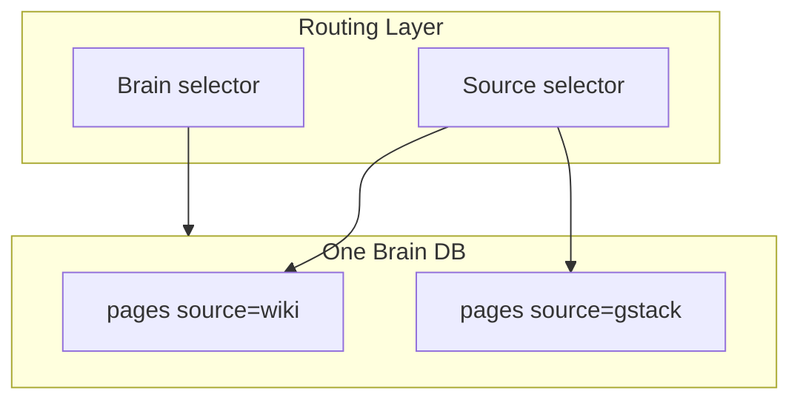

# 用正交双轴模型分离「数据库」与「内容仓库」路由

## 1. 背景与场景

个人知识系统演进为：**一人多 repo**（笔记、代码仓文档、团队 wiki）、**多 brain 挂载**（个人库 + 团队发布库）、**公司 brain 多租户**（OAuth 客户端只能读/写授权 source）。若用单一「项目 ID」混装，会出现两类 silent misroute：

1. 在 A repo 查到了 B repo 的 slug（同 slug 不同 source）
2. 远程 token 只授权 dept-x，却通过 `__all__` 或漏 filter 读到全库

## 2. 要解决的核心问题

- 路由维度混淆 → 跨 repo / 跨租户泄漏
- CLI 在子目录工作时需自动 pin 到正确 repo
- 联邦读（读多个 source）与写 authority（单 source 写）需独立配置

## 3. 可选方案

| 方案 | 做法 | 问题 |
|------|------|------|
| 单库 global slug | slug 全局唯一 | 多 repo 合并困难；团队/个人 slug 冲突 |
| 每 repo 独立 DB | 完全物理隔离 | 跨 repo 检索需联邦层；运维成本高 |
| **Brain + Source 正交轴（选用）** | 一 DB 多 source；可多 DB mount | 需统一 precedence 解析与 SQL `source_id` 过滤 |
| path 前缀当 tenant | `wiki/...` vs `gstack/...` | 与 slug 耦合；重命名/repo 迁移痛苦 |

## 4. 决策与理由

定义两条**独立**路由轴，各自六层 precedence（flag → env → dotfile → 注册表 → 默认）：

| 轴 | 含义 | 典型路由键 |
|----|------|------------|
| **Brain** | 哪个数据库实例 | `--brain`、`GBRAIN_BRAIN_ID`、mounts 注册 |
| **Source** | 该 DB 内哪个内容仓库 | `--source`、`GBRAIN_SOURCE`、`.gbrain-source` |

数据模型：`pages` 行带 `source_id`；slug 唯一约束为 **(source_id, slug)** 复合键，非全局 slug。

**写 authority**（OAuth `sourceId`）与 **读 federation**（`allowedSources[]`）分离：客户端可写 dept-x、读 `[dept-x, parent, shared]` 并集。

**规则 of thumb**：数据所有者变 → Brain 边界；同一所有者下换 repo/topic → Source 边界。

## 5. 核心抽象

- **BrainRegistry**：解析 brainId → Engine 实例
- **OperationContext.sourceId**：当前调用绑定的 source（必填 string，默认 `'default'`）
- **AuthInfo.allowedSources**：远程读侧联邦授权列表
- **sourceScopeOpts(ctx)**：把 context 转为 engine 查询的 `{ sourceId }` 或 `{ sourceIds[] }`

## 6. 通用结构图

## 7. 适用条件

- 单 DB 托管多 repo / 多团队 slice
- 需要 mount 外部只读/读写 brain
- Agent 在 monorepo 不同子目录工作，需 dotfile 自动 pin source
- 公司 brain：OAuth per-client source + federated read

## 8. 不适用 / 反例

- 永远单一 flat 笔记库、无共享、无 mount → 可只用 default source
- 强物理隔离合规（DB 级硬隔离）→ 应用 Brain 轴拆实例，而非仅 source
- slug 全局唯一且永不联邦 → Source 轴价值降低

## 9. 已知代价

- 每个 read handler 必须经 `sourceScopeOpts`，漏一处即泄漏类 bug
- Link 读 op 在 scalar vs federated 分支行为不同，remote 需 promote 为 `sourceIds[]`
- 文档与 agent skill 必须教双轴，否则 query misroute silent

## 10. 落地要点

1. Schema：`source_id TEXT NOT NULL` on pages；`UNIQUE(source_id, slug)`
2. Context：`sourceId` 必填；OAuth 写 `auth.sourceId` + `auth.allowedSources`
3. 单一 helper `sourceScopeOpts`：precedence federated > scalar > `{}`
4. Per-call override resolver：remote 禁止 `__all__` 逃逸（见方案层 trust 卡）
5. CLI dotfile `.gbrain-source` / mount dotfile `.gbrain-mount`
6. 文档与 RESOLVER 决策表：何时切 brain vs source

## 11. 标签

architecture, multi-tenant, routing, federation, orthogonal-axes

---

## 附录：来源证据（仅供溯源核实，阅读正文无需依赖此节）

| 项 | 位置 |
|----|------|
| 双轴 mental model | `docs/architecture/brains-and-sources.md:13-56` |
| OperationContext 定义（含 sourceId 必填） | `src/core/operations.ts:277-301`（`sourceId` 字段见同接口内） |
| AuthInfo sourceId + allowedSources | `src/core/operations.ts:231-275`（`sourceId` 在 :261，`allowedSources` 在 :274） |
| sourceScopeOpts precedence | `src/core/operations.ts:417-426` |
| linkReadScopeOpts remote promote | `src/core/operations.ts:443-448` |
| resolveRequestedScope fail-closed（含 `__all__` 规则） | `src/core/operations.ts:455-493`（注释 :455-472，函数 `resolveRequestedScope` :473） |
