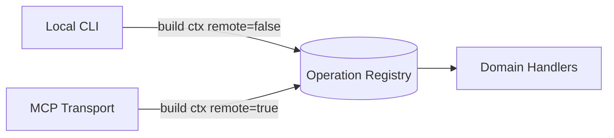

# 用统一操作契约为 CLI 与 Agent 工具提供单一真相源

## 1. 背景与场景

系统同时暴露两条调用面：**本地 CLI**（运维、批量、可信操作）和 **Agent 远程工具**（MCP stdio/HTTP，不可信）。若两条通道各自维护 handler 列表，必然漂移——CLI 多了字段、MCP 漏校验、scope 不一致，最终在多租户场景下变成 silent bug 或数据泄漏。

典型触发条件：功能数 > 30、存在 read/write/admin 分级、需要 OAuth scope 与 `localOnly` 隔离。

## 2. 要解决的核心问题

- 双通道重复实现 → 行为不一致、测试矩阵爆炸
- Agent 工具面与 CLI 能力不对齐 → 文档说谎、集成踩坑
- 新增能力时改多处 → 漏改 remote 路径是常见泄漏类

## 3. 可选方案

| 方案 | 做法 | 优点 | 缺点 |
|------|------|------|------|
| A. 通道各自实现 | CLI 一套命令、MCP 一套 tool | 各通道优化自由 | 漂移不可控 |
| B. OpenAPI 生成 | 先写 spec 再生成 stub | 工业标准 | Agent 工具 + 复杂 bulk CLI 难用纯 REST 表达 |
| **C. 内存 Operation 注册表（选用）** | 单一 `Operation[]`：name、params、scope、handler | 一处改、双通道消费；handler 可复用 domain 逻辑 | 需 discipline：bulk CLI 不能绕过契约乱写 |
| D. gRPC 单服务 | 统一 RPC | 强类型 | MCP 生态、人类 CLI 体验需额外适配层 |

## 4. 决策与理由

**选 C**：在核心层维护 `Operation` 接口数组，字段至少包含：

- `name`、`description`、`params`（带 type/required）
- `handler(ctx, params)` — 唯一业务入口
- `scope?: 'read' | 'write' | 'admin' | …` — 远程 OAuth 校验用
- `localOnly?: boolean` — 仅本地 CLI，不暴露给 HTTP MCP 工具列表
- `cliHints?` — CLI 命令名、positional、hidden

**放弃 A**：已观测到 stdio/HTTP 曾因 dispatch 分叉导致参数顺序、context 字段遗漏类 bug，故抽出共享 `dispatchToolCall`。

**放弃「全部走 Operation」的纯化**：复杂 bulk 命令（sync、doctor、eval）保留 CLI_ONLY 编排层，但读写 brain 状态仍应下沉到 Operation 或 core 函数，避免第三套逻辑。

## 5. 核心抽象

**Operation = 能力单元**；**OperationContext = 单次调用的信任与环境快照**（engine、config、remote、sourceId、auth…）。所有 transport 只做三件事：解析参数 → 构建 Context → 调用 `op.handler`。

CLI 从 `operations` 过滤 `cliHints.name` 生成子命令；MCP 用同一数组 `buildToolDefs(operations)`；HTTP MCP 额外 `filter(op => !op.localOnly)`。

## 6. 通用结构图

## 7. 适用条件

- 同一后端服务多种入口（CLI + MCP/HTTP + 未来 SDK）
- 能力数量持续增长（数十～上百）
- 需要 scope / localOnly 分级
- 团队能接受「新能力默认先进 Registry」纪律

## 8. 不适用 / 反例

- 纯只读脚本、无 Agent 面、<10 个命令 → Registry 过重
- 强 CQRS 且读写物理分离 → 单一 handler 表需拆 read/write service
- 无 OAuth/remote 场景且永远单一 CLI → 可简化 scope 层

## 9. 已知代价

- `operations.ts` 单文件膨胀（100+ op），需按域拆分定义再汇总数组
- CLI_ONLY 与 Operation 并存，新人需理解「何时 bypass」
- 每个 op 的 params schema 需与 handler 同步维护

## 10. 落地要点

1. 定义 `Operation` + `OperationContext` 类型，`remote` 与 `sourceId` 设为必填（TypeScript 层强制）
2. 实现共享 `dispatchToolCall(name, params, opts)`：validateParams → buildContext → handler → 统一 JSON 错误形
3. CLI：`remote: false`；MCP stdio/HTTP：默认 `remote: true`
4. HTTP 工具列表排除 `localOnly`；scope 用层级函数 `hasScope(tokenScopes, op.scope)`
5. 新增能力 checklist：handler、params、scope、是否 localOnly、cliHints、read-side scope helper

## 11. 标签

architecture, contract-first, mcp, cli, single-source-of-truth

---

## 附录：来源证据（仅供溯源核实，阅读正文无需依赖此节）

| 项 | 位置 |
|----|------|
| Operation 接口定义 | `src/core/operations.ts:589-619` |
| operations 数组导出（100 项） | `src/core/operations.ts:5316-5401` |
| 共享 dispatch | `src/mcp/dispatch.ts:1-7` 文件头注释；`dispatchToolCall` :222-283 |
| MCP ListTools 来源 | `src/mcp/server.ts:27-28` `buildToolDefs(operations)` |
| HTTP 过滤 localOnly | `src/commands/serve-http.ts:1449` |
| CLI remote=false | `src/cli.ts` 经 `gbrain call` 路径（AGENTS.md / CLAUDE.md  invariant） |
